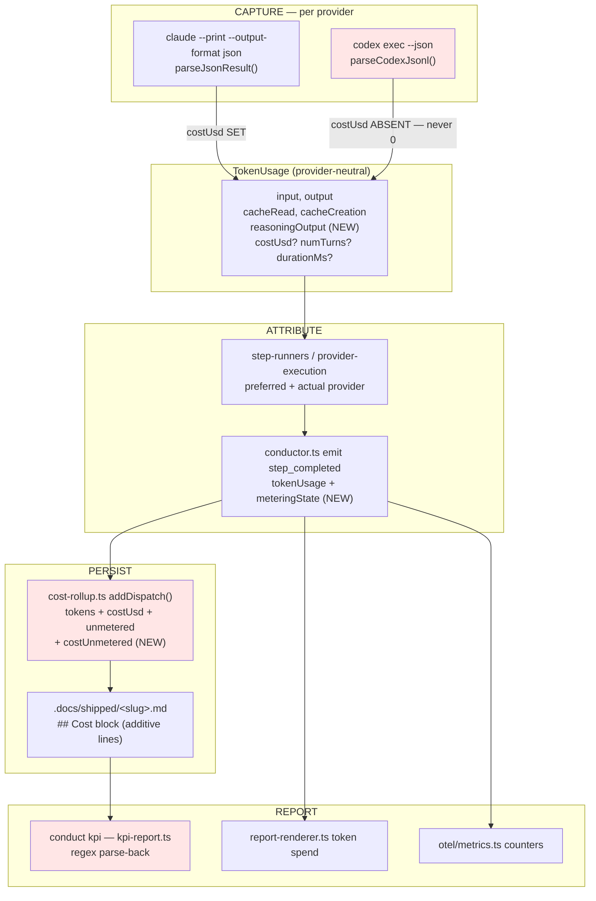

# Architecture: Codex usage metering and cost attribution (#906, absorbs one #1008 facet)

## Context

Usage metering was built Claude-first (#537, ADR-2026-07-22-a/b). Codex parsing was added
later by #904's family but deliberately deferred all usage accounting to #906. The result
is a metering model that cannot express Codex's actual billing shape, so Codex work is
reported as **fully metered at $0.00**.

This repo runs `llm_provider: [codex, claude]` today (`.ai-conductor/config.yml:106`), with
`build` on Codex, so every feature it ships is currently mis-metered.

## The core structural decision: metering is three-valued

Today `unmetered` is a single boolean derived at `conductor.ts:5987` as
`tokenUsage ? undefined : true`. That boolean cannot represent Codex, which reports real
tokens but has no USD cost (subscription billing). Modeling reality requires three states:

| State | Tokens | Cost | Produced by |
|---|---|---|---|
| `fully-metered` | yes | yes | Claude (`total_cost_usd`) |
| `cost-unmetered` | **yes** | **no** | Codex (`turn.completed.usage`, subscription) |
| `unmetered` | no | no | non-LLM **dispatches**; parse failure; interactive dispatches |

The existing `unmetered` keeps its exact present meaning (the third row). The second row is
**new and additive** — which is what makes every committed record already on main keep
parsing correctly.

**Amended 2026-09-07** (`adr-2026-07-27-cost-unmetered-is-a-first-class-state` D5-D7, feature
`stop-counting-provider-free-step-completions-as-un`, #1906): the table classifies **dispatches**.
A `step_completed` record that no invoked provider attempt matched and that carries no
`tokenUsage`, `actualProvider`, `preferredProvider` or `model` never called a provider, so it is
excluded before classification — it is neither metered nor unmetered and has no row here. A
non-LLM step that *did* invoke a provider and reported no usage is still the third row.

This preserves ADR-2026-07-22-b's governing principle — *"a partial total is visibly
partial"* — and extends it: a total that omits Codex cost must be visibly partial too,
rather than silently summing Codex in at zero.

## Flow



Red nodes are where this feature changes behavior.

## Key structural decisions

### 1. Absent cost is represented by absence, never by zero
`parseCodexJsonl` must leave `TokenUsage.costUsd` **undefined** for Codex. The rollup then
classifies that dispatch as `cost-unmetered` instead of adding `0`. The current defect is
precisely that `cost-rollup.ts:54` (`Number(tokenUsage.costUsd) || 0`) collapses "unknown"
and "zero" into the same value.

### 2. Codex per-step usage is a SUM across turns, not the last turn
`codex exec --json` emits one `turn.completed` per turn. `codex-provider.ts:97` currently
**assigns** on each, so a multi-turn run reports only its final turn. Accumulation is the
correct semantic: a step's usage is the whole dispatch. `numTurns` falls out for free as the
count of `turn.completed` events, giving Codex parity with Claude's `num_turns`.

Claude is unaffected — its `--output-format json` result is already whole-run cumulative.

### 3. The `## Cost` block grows by ADDITION only
The block is a two-sided contract: written by `shipped-record.ts:146-172`, read back by
regex in `kpi-report.ts:31-67`. Two properties make additive growth safe, and both are
already true of the existing code:

- `parseCostBlock` looks up each field by name and defaults missing ones
  (`num('cache_read') ?? 0`), so a **new** line is ignored by an old reader and a **missing**
  line is tolerated by a new reader. Records already on main keep parsing.
- Field lookups anchor with `^name:` under the `m` flag, while per-provider lines are
  two-space indented (`  codex: input: …`). New top-level fields therefore cannot be
  shadowed by provider lines.

No existing line changes meaning or format. `unmetered:` in particular keeps its current
semantics so historical records are not silently reinterpreted.

### 4. Token aggregates and cost aggregates decouple
`kpi-report.ts:125-136` currently drops a feature from **all** aggregates if it has any
unmetered dispatch. Once Codex is correctly marked cost-unmetered, that rule would erase
every mixed-provider feature — i.e. every feature this repo ships — from KPI entirely.

So the exclusion must split: a cost-unmetered dispatch disqualifies the feature from **cost**
aggregates only; its tokens still aggregate. This is what makes issue outcome (3) — "cost
rollups continue to work for Claude and mixed historical event logs" — actually hold.

### 5. The fixture is a real capture, not a hand-written sample
The only Codex stream in the test suite today is synthetic
(`codex-provider.test.ts:37-46`). Issue outcome (4) asks for "at least one real or fixture
Codex JSONL stream". A real captured `codex exec --json` transcript is committed as a
fixture file, so the parser is tested against the schema the CLI actually emits — and a
future CLI schema drift is detectable by re-capturing. Per `.agents/skills/write-tests`,
the fixture is replayed through the exported pure helper `parseCodexJsonl`; **no ordinary
test invokes the real `codex` binary** (that stays in `codex-provider.smoke.test.ts`).

Captured against `codex-cli 0.145.0`, verbatim:

```jsonl
{"type":"thread.started","thread_id":"019fa5c2-2f4f-7063-a2c1-f29270e54bc7"}
{"type":"turn.started"}
{"type":"item.completed","item":{"id":"item_0","type":"agent_message","text":"pong"}}
{"type":"turn.completed","usage":{"input_tokens":18057,"cached_input_tokens":0,"cache_write_input_tokens":0,"output_tokens":5,"reasoning_output_tokens":0}}
```

Note `cache_write_input_tokens` and `reasoning_output_tokens` — both are emitted by the CLI
and both are dropped by the current parser.

### 6. `durationMs` stays absent for Codex
Claude's JSON result carries `duration_ms`; the Codex stream carries no equivalent.
Rather than synthesize one from engine wall-clock (which measures something different —
process time, not model time), it is left absent. Same principle as decision 1: do not
invent a number to fill a field.

## Interfaces changed

| Surface | Change |
|---|---|
| `llm-provider.ts` `TokenUsage` | add optional `reasoningOutput` |
| `codex-provider.ts` `parseCodexJsonl` | accumulate across turns; map `cache_write_input_tokens`→`cacheCreation`, `reasoning_output_tokens`→`reasoningOutput`; derive `numTurns` |
| `cost-rollup.ts` `CostRollup`/`ProviderCostRollup` | add `costUnmetered: { count }`; classify in `addDispatch` |
| `events.ts` `step_completed` | metering state is derivable from `tokenUsage`+`costUsd`; `unmetered` retained unchanged for compatibility |
| `shipped-record.ts` | emit `cost_unmetered:` top-level + per-provider |
| `kpi-report.ts` | parse the new field; split cost vs token aggregate exclusion; render `providers:` and the six currently-unrendered fields (**#1008**) |
| `docs/reference/artifacts.md` | remove the #1008 "Known limitation" note once satisfied |

## Out of scope

- **D5 — interactive dispatch metering.** `codex-provider.ts:192-215` and
  `claude-provider.ts:561` pass JSON off unconditionally, so every `invokeInteractive` run is
  unmetered for **both** providers. Real, but a separate change touching Claude's path.
- **Deriving Codex cost from a price table.** Explicitly rejected — see ADR.
- **Operator-session metering**, already out of scope per the #537 review.
