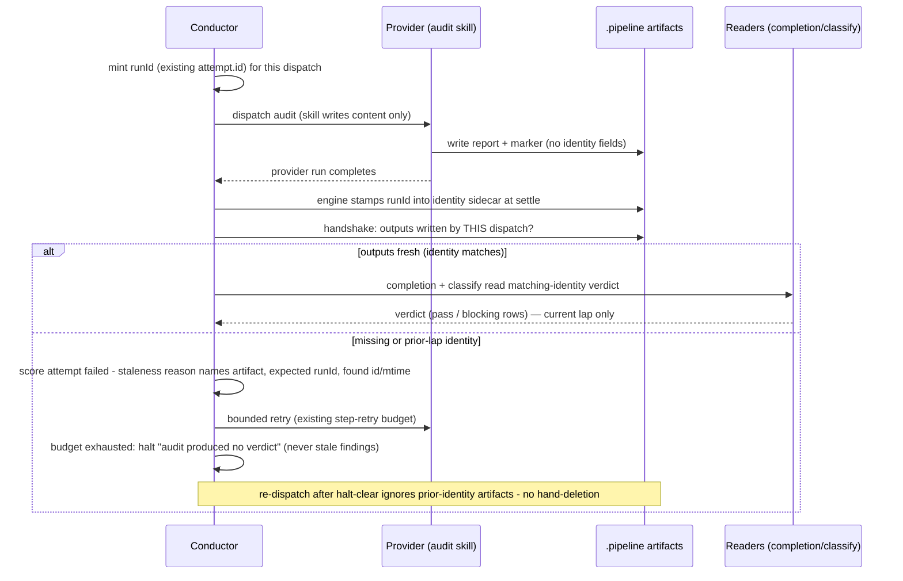

# Architecture: SHIP-tail verdict run-identity contract (#1838)

**Last updated:** 2026-08-26
**Scope:** How per-dispatch run identity flows from the engine into the SHIP-tail verdict
artifacts (prd_audit, architecture_review_as_built, manual_test) and back through every
reader — completion checks, `classifyPrdAuditGaps`, and the halt/routing paths — plus the
post-dispatch write handshake.

## Components

```mermaid
graph TD
    subgraph Engine ["Engine (conductor.ts)"]
        DISP["Step dispatcher<br/>issues runId per verdict dispatch"]
        HANDSHAKE["Write handshake<br/>post-dispatch: outputs exist + carry runId"]
        RETRY["Retry classifier<br/>bounded retry, then halt"]
        HALT["Halt writer<br/>names artifact + expected/found identity"]
    end

    subgraph Skills ["Verdict skills (provider-run)"]
        PRD["prd-audit skill"]
        ASBUILT["architecture-review as-built"]
        MANUAL["manual-test skill"]
    end

    subgraph Artifacts [".pipeline/ verdict artifacts"]
        REPORT["prd-audit.md + marker<br/>Run-Id: «runId»"]
        ASREPORT["architecture-review-as-built.md + marker<br/>Run-Id: «runId»"]
        MREPORT["manual-test results + marker<br/>Run-Id: «runId»"]
    end

    subgraph Readers ["Readers"]
        COMPLETE["Completion checks (artifacts.ts)<br/>identity match, mtime fallback"]
        CLASSIFY["classifyPrdAuditGaps (artifacts.ts)<br/>identity match (was session-mtime)"]
        PLANGAP["routeCurrentPrdAuditPlanGaps (conductor.ts)<br/>PLAN_GAP halt/record route"]
        OVERSCOPE["routeCurrentPrdAuditOverScope (conductor.ts)<br/>OVER_SCOPE halt/record route"]
    end

    DISP --> PRD
    DISP --> ASBUILT
    DISP --> MANUAL
    PRD -->|"content only"| REPORT
    ASBUILT -->|"content only"| ASREPORT
    MANUAL -->|"content only"| MREPORT
    DISP -->|"engine stamps Run-Id at settle<br/>(second field beside codeStamp)"| REPORT
    HANDSHAKE -->|verifies| REPORT
    HANDSHAKE --> ASREPORT
    HANDSHAKE --> MREPORT
    HANDSHAKE -->|"missing / mismatched"| RETRY
    RETRY -->|"budget exhausted"| HALT
    COMPLETE -->|reads| REPORT
    CLASSIFY -->|"fresh-identity rows only"| REPORT
    HANDSHAKE -->|"cleared: this dispatch wrote it"| PLANGAP
    HANDSHAKE -->|"cleared: this dispatch wrote it"| OVERSCOPE
    PLANGAP -->|"current-lap rows only"| REPORT
    OVERSCOPE -->|"current-lap rows only"| REPORT
    PLANGAP --> HALT
    OVERSCOPE --> HALT
```

## Sequence: stale-verdict prevention

## Legend

- «runId» — engine-issued per-dispatch identifier (precedent: build_review `lapId`).
- Mtime fallback applies only to legacy artifacts written before this contract.
- build_review is out of scope: it already carries `lapId`.

## Change Log

| Date | Change | Reason |
|------|--------|--------|
| 2026-08-25 | Initial generation | DECIDE for #1838 (spec authoring) |
| 2026-08-26 | Added the two prd-audit routing readers and their handshake gate | As-built finding 3: the Readers subgraph omitted the shipped halt/routing readers |
