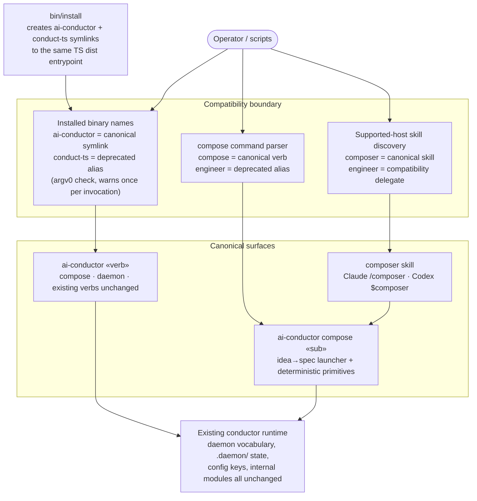

# Components: v1.0 Naming Surfaces (engineer→Composer, ai-conductor CLI; daemon stays)

**Last updated:** 2026-08-28
**Scope:** The naming surfaces the revised 1.0 rename touches, and the alias/deprecation
transition layer that keeps old names working through the major. Supersedes the 2026-08-26
player/composer implementation view (operator reversal): the `daemon`→`player` rename is
dropped — `daemon` vocabulary, `.daemon/` state, and existing config keys are unchanged.
`bin/conduct` removal and installer cutover remain #226; verdict vocabulary remains #1918.

## Diagram

## Legend

- **Compatibility boundary** — canonicalizes old names once at the entry point. New docs and
  code speak `ai-conductor` / `compose` / `composer`; old names remain temporary aliases that
  forward to the same typed dispatch and print a deprecation warning. Aliases never own a second
  implementation.
- **Installed binary names** — `bin/install` symlinks both `ai-conductor` (canonical) and
  `conduct-ts` (deprecated) at the same TS dist entrypoint; the process warns when invoked as
  `conduct-ts` (argv0 basename), once per invocation, on stderr.
- **Daemon vocabulary unchanged** — `ai-conductor daemon «sub»` is canonical as-is: no `player`
  command, no `.player/` state root, no config-key renames, no state-resolution boundary.
- **Internal engine** — internal module/type/file names (`engineer-cli.ts`, `daemon-*.ts`,
  `src/engine/`) are not renamed; the vocabulary boundary is the parser, skill catalog, and
  installer only.
- `« »` marks variable parts.
- The `bin/conduct` bash CLI is untouched here; its removal and the installer's hard-requirement
  rework are #226. Event-spine identifiers do not rename.

## Change Log

| Date | Change | Reason |
|------|--------|--------|
| 2026-08-26 | Initial generation | DECIDE for #227 (music-vocabulary rename scoping) |
| 2026-08-26 | EVENTS open question resolved: no rename | ADR approved; plan authored |
| 2026-08-26 | Replaced the scoping-only view with the implementation architecture | Operator selected complete rename implementation in #1921 review |
| 2026-08-28 | Dropped the player rename; added ai-conductor canonical binary + compose verb | Operator reversal — daemon stays, ai-conductor is the CLI name |
