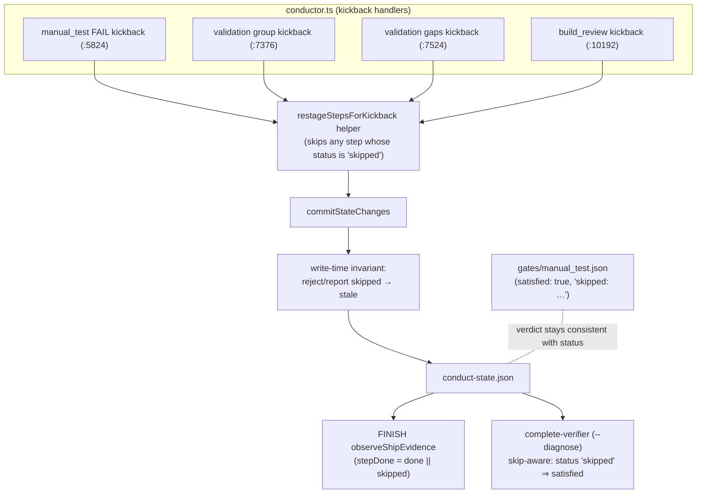
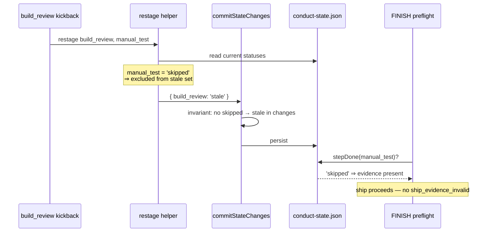

# Components + Sequence: skip-preserving kickback restage (#1987)

**Last updated:** 2026-08-27
**Scope:** the kickback restage path in the conductor state machine — how a `skipped` step
status survives every kickback, how a `skipped → stale` divergence is surfaced at the write,
and how `--diagnose` reports legitimately skipped steps.

## Diagram

## Legend

- **restage helper** — the single routing point for all four explicit kickback restage sites;
  `markDownstreamStale` (state.ts:290) is already skip-safe and is unchanged.
- **invariant** — defence in depth: even a future call site that bypasses the helper cannot
  silently persist a `skipped → stale` transition; the divergence is surfaced at the write.
- Dashed line — the gate file's recorded skip verdict and the step status can no longer
  disagree, because the status is never overwritten.

## Change Log

| Date | Change | Reason |
|------|--------|--------|
| 2026-08-27 | Initial generation | DECIDE for #1987 (engineer worktree) |
