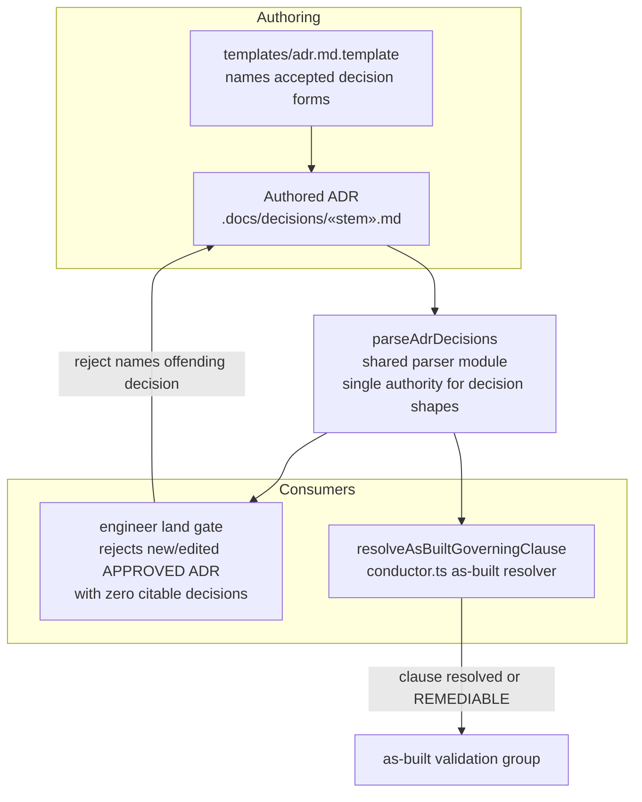

# Architecture: ADR Decision-Shape Contract (issue #2054)

**Last updated:** 2026-09-02
**Scope:** Shared ADR-decision parser as the single citability authority; land-time gate; consumers.

## Diagram

## Legend

- `parseAdrDecisions` — new shared module; every consumer of `## Decision` content calls it.
  The AB-R12 shape knowledge (numbered list, bolded D-heading, ATX heading) moves here.
- The land gate applies only to ADRs added/modified in the spec diff — the legacy corpus is
  not re-validated.

## Change Log

| Date | Change | Reason |
|------|--------|--------|
| 2026-09-02 | Initial generation | DECIDE for issue #2054 |
