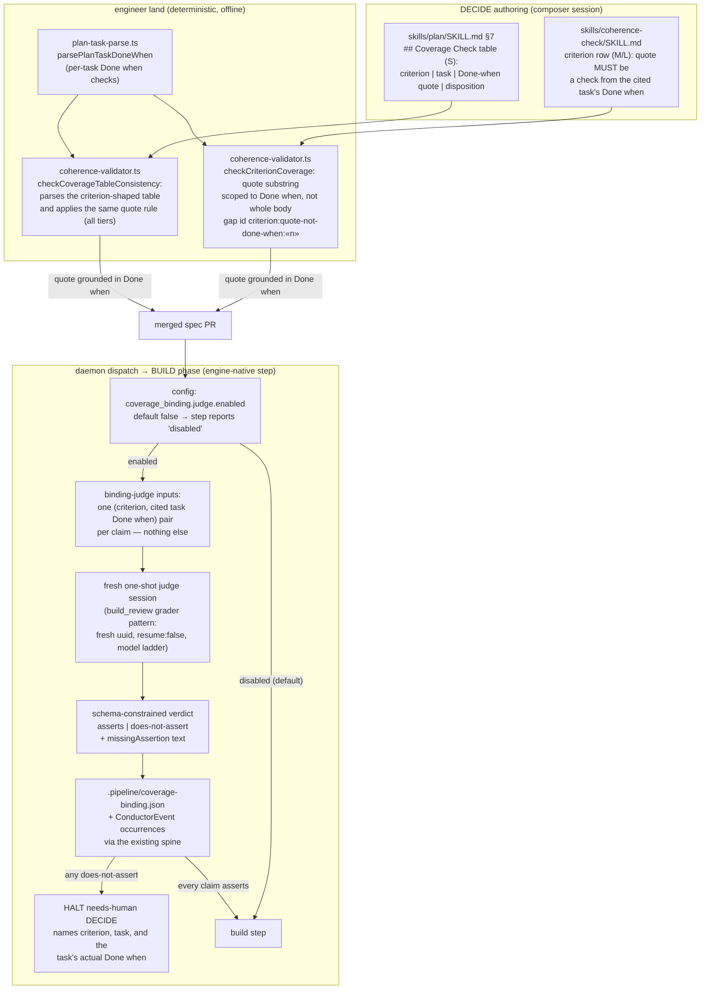
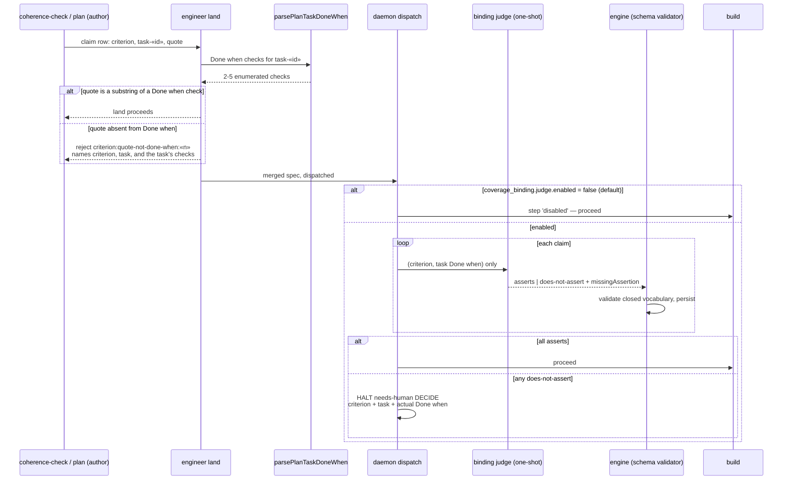

# Components + Sequence: coverage claims bound to `Done when` (#2088)

**Last updated:** 2026-08-31
**Scope:** how a criterion→task coverage claim is grounded before BUILD. Two mechanisms on both
claim surfaces (the coherence artifact's criterion rows at M/L, the plan's own coverage table at
S): a mechanical land-time contract that the claim quotes a check from the cited task's
`Done when` block, and a config-gated (default off) fresh-context binding judge that runs as an
engine-native BUILD-phase step before `build` and halts to DECIDE when the cited check does not
assert the criterion.

## Diagram

## Legend

- **Done-when scoping (mechanical)** — today `checkCriterionCoverage` proves only that the quoted
  text exists somewhere in the cited task's body. The contract narrows the search to the output of
  `parsePlanTaskDoneWhen` for that task, so a claim must point at a falsifiable completion check.
  The rejection is a coverage-shaped gap with a stable id in the existing waiver vocabulary.
- **S-tier surface** — the plan's `## Coverage Check` table gains the same three-cell shape
  (criterion | task | Done-when quote | disposition) and the same quote and disposition rules, checked at land at every tier;
  Small specs currently have no parsed claim surface at all.
- **binding judge (judgement)** — the question "does this check assert this criterion" is
  judgement-shaped. Machinery scopes the inputs to one pair per claim and persists the verdict; the
  LLM answers only that question, output constrained to a closed vocabulary the engine validates.
  Runs at every dispatch, so a coverage amendment made after land is re-judged.
- **default off** — the step is config-gated and ships disabled; a follow-up PR flips the default
  after this spec lands. Disabled reports success with a `disabled` output, mirroring the
  `build_review` gate-disabled branch, so no existing build path changes behavior.
- **placement** — a BUILD-phase engine-native step after `plan`/`coherence_check` and before
  `acceptance_specs`/`build`, not tier-skippable. It is not inside `land`, honoring
  `adr-2026-07-22-coherence-gate-placement-and-validation-split`'s rejection of a model
  dependency at land; that ADR is amended to place the step.

## Change Log

| Date | Change | Reason |
|------|--------|--------|
| 2026-08-31 | Initial generation | DECIDE for #2088 (approach C, judge default off) |
| 2026-08-31 | Plan-update pass: S rows are four cells (disposition added); halt rides step_refused/loop_halt; two step-specific events | /plan §8b for #2088 |
