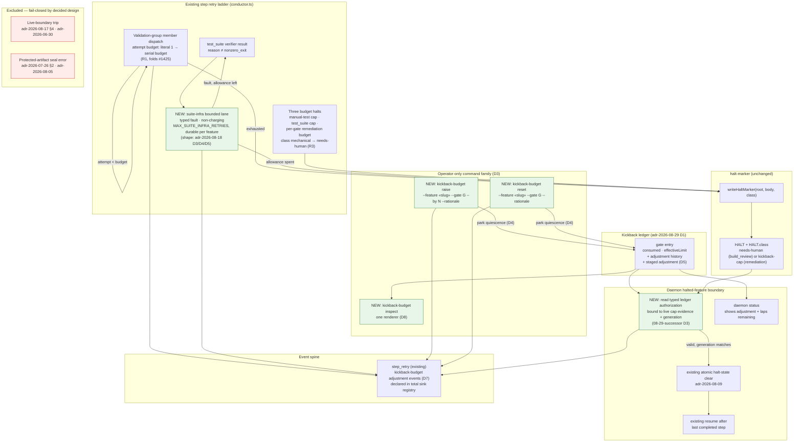

# Components: bounded retries at the raiser and operator budget recovery (#2190)

**Last updated:** 2026-09-05
**Scope:** The two halves as approved by architecture-review — (1) retry at the raiser inside the
existing retry ladder, no new dispatch state; (2) the `kickback-budget` operator command family from
adr-2026-08-29, with the daemon clearing the halt on authorization. Nothing here adds a marker, a
timer, or a grant kind.

## Diagram

## Legend

- Green — new by this feature. Red — explicitly excluded; these halts stay fail-closed and are
  never retried, by adr-2026-08-17, adr-2026-06-30, adr-2026-07-26, adr-2026-08-05.
- «…» — variable segment placeholder.
- No new dispatch state, marker, timer, or grant store. `pickEligible` and `HALT.class` remain
  unchanged; `rekickSweep` is the shared halt-retention seam used by base-advance, progress, and
  episode-end recovery (adr-2026-08-05 §4, adr-2026-07-28 D2).
- The CLI never clears a halt (08-29 D6; adr-2026-08-03 D6). It records an authorization in the
  ledger; the daemon boundary consumes it and clears through the existing atomic clear.
- The `mechanical` class is unchanged in meaning; three writers move to `needs-human` because a
  budget exhaustion must not be auto-cleared by the base-advance sweep (adr-2026-07-26 D4).

## Change Log

| Date | Change | Reason |
|------|--------|--------|
| 2026-09-05 | Initial generation (DEFERRED + laps-grant design) | DECIDE for #2190 |
| 2026-09-05 | Scoped DEFERRED writers to four raisers; mechanical unchanged | architecture-review found mechanical includes budget halts |
| 2026-09-05 | Rewritten to resolution R + absorbed adr-2026-08-29 command family | architecture-review BLOCKED on six APPROVED ADRs; operator chose R and absorb |
