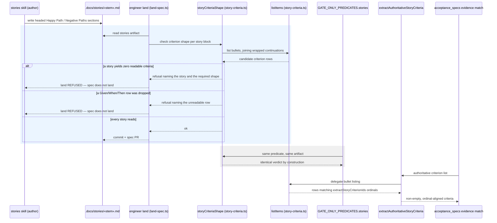

# Sequence: One structural predicate for accepted-story criteria

**Last updated:** 2026-09-23
**Scope:** Where an accepted stories artifact is checked for criterion readability, which
component owns that judgement, and how the land gate, the daemon `stories` gate, and the
`acceptance_specs` evidence matcher are made to read the same artifact the same way.

## Diagram

## Legend

- **`storyCriteriaShape`** is the new single owner of "is this an engine-readable accepted
  story". It lives in `story-criteria.ts` beside the parsing primitives it uses, so it cannot
  drift from them. It is the only component that answers this question.
- **`engineer land`** and **`GATE_ONLY_PREDICATES.stories`** are drawn calling the *same*
  node deliberately: agreement between them is structural, not a convention. Today they are
  two independent implementations, and the `engineer` spec-PR path never runs the second one
  at all — which is how a story that the gate would reject reached a sealed artifact.
- **`listItems`** already joins a bullet's indented continuation lines.
  `extractStoryCriterionIds` uses it; `extractAuthoritativeStoryCriteria` does not, and matches
  line-by-line instead. Routing both through `listItems` is what removes the ordinal drift
  between the two extractors.
- The **grey band** is verification, not new enforcement: once both consumers call one
  predicate there is no second answer for them to disagree about.
- **`acceptance_specs`** is unchanged in this design. It becomes satisfiable because the
  artifact reaching it is now guaranteed readable — the deadlock is removed upstream rather
  than tolerated at the point of failure.

## Change Log

| Date | Change | Reason |
|---|---|---|
| 2026-09-23 | Initial diagram for the shared-predicate design. | Make the single ownership of criterion-shape judgement, and the two consumers that must call it, explicit before implementation (#1744). |
