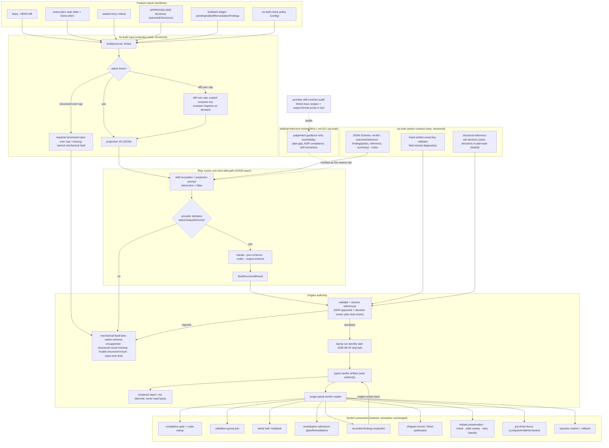
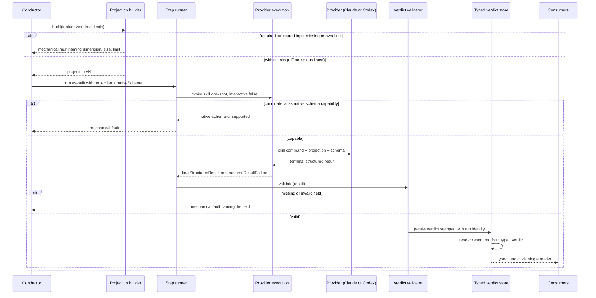

# Components: as-built review on an engine-owned input projection and typed verdict

**Last updated:** 2026-09-23
**Scope:** The `architecture_review_as_built` step (#2188). Today the reviewer gathers its own
evidence under a six-line `AS-BUILT CHECK POLICY` block and writes
`.pipeline/architecture-review-as-built.md`, which about eight engine sites re-parse with regexes
(verdict line, `Outcome delivered:` line, `## Blocking Findings` table, governing-clause grammar,
`## Recorded Findings` JSON block). This change moves both sides of the step onto engine-owned
contracts. The engine renders a bounded, versioned input projection. The step dispatches on the
#2429 `nativeSchema` seam. The engine validates the terminal structured result, stamps run
identity, persists the typed verdict as the sole authority, and renders the human-readable report
from it. Verdict vocabulary, routing, remediation admission, operator authority, and delivery
semantics are unchanged in meaning; only their input changes from scraped Markdown to the typed
verdict.

## Diagram

## Sequence: one as-built dispatch

## Legend

- **As-built input projection** — new engine module. Rendered by the dispatcher, versioned, and
  bounded per dimension. Diff content past its cap degrades to an explicit list of omitted files
  that the reviewer may inspect on demand; a required structured dimension (plan tasks and
  Done-when, sealed story criteria, approved ADR decisions) that is missing or over its limit is a
  named mechanical fault, never silent truncation (precedent: adr-2026-09-07 D7). Prior findings
  are only those already available (`pendingAsBuiltRemediationFindings`); new finding-history
  inputs belong to #2440.
- **As-built verdict contract** — new engine module. The JSON Schema handed to the provider
  natively and a hand-written exact-key validator (no schema library; precedent:
  `prd-widening-contract.ts`). Verdict vocabulary stays `APPROVED | APPROVED WITH DRIFT NOTES |
  PLAN_GAP | BLOCKED`; finding class stays `REMEDIABLE | DESIGN`. References are structural
  objects, replacing the governing-clause text grammar; resolution through `parseAdrDecisions` and
  plan task bodies is retained.
- **Step runner one-shot skill path** — the path #2429 added for `remediate`
  (`executeProviderAwareSkillOneShot`), extended to this step. `interactive` is forced false
  because the Claude adapter refuses `nativeSchema` interactively.
- **Typed verdict store** — the authority every consumer reads through one reader. The `.md`
  report is rendered from it and is never parsed. The engine, not the reviewer, is the writer, so
  the dispatch-write handshake and the mandatory-overwrite instruction in the skill no longer
  apply. Recorded-findings projection updates the typed store and re-renders.
- **Mechanical-fault lane** — unsupported capability, missing structured result, invalid field, and
  over-limit input are mechanical faults, never a substantive verdict.
- **Dotted edges** — the skill invocation and the audit are not on the data path. The audit is
  scoped to the as-built section because the skill file also serves the pre-stories and
  drift-check modes.

## Change Log

| Date | Change | Reason |
|------|--------|--------|
| 2026-09-23 | Initial generation | Spec for #2188 — as-built bounded inputs and typed verdicts |
| 2026-09-23 | Add the pre-finish fence and operator rewind as typed-verdict consumers | Plan update: consumers found by the repo-wide ADR sweep (architecture review A-8) |
