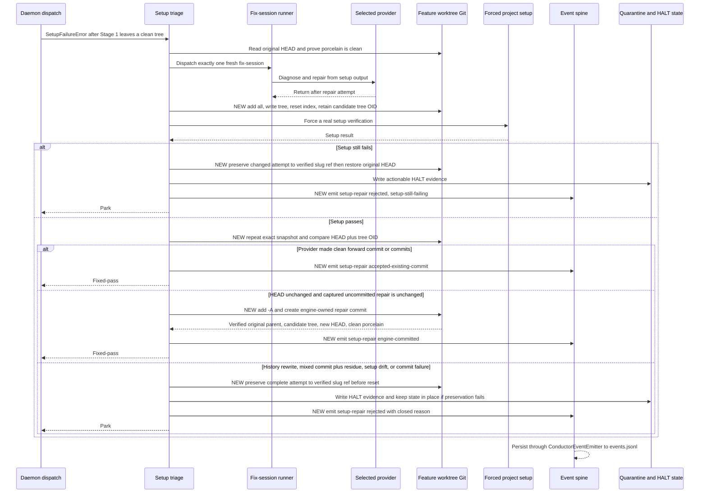

# Sequence: Verified setup repair retention (#1346)

**Last updated:** 2026-08-29
**Scope:** Proposed daemon-only flow after setup triage reaches its one bounded fix-session.

## Diagram

## Legend

- `NEW` marks behavior introduced by this feature; the existing one-fix-session bound and forced
  setup verification remain unchanged.
- The pre-provider HEAD plus porcelain proof establishes the attribution boundary. The post-provider
  snapshot is the only uncommitted content eligible for an engine-owned repair commit. Snapshotting
  uses Git's tree object identity so edits, deletions, mode changes, and untracked additions are all
  compared exactly while the index is restored to the candidate HEAD between checks.
- Setup verification may read or write ignored operational state, but any tracked or untracked Git
  drift relative to the captured repair snapshot rejects automatic commit.
- Rejected attempts are restored only after the complete provider history and residue are reachable
  from a verified `wip/setup-quarantine-<slug>` ref. A failed preservation leaves the attempt in
  place; a failed restore keeps the verified recovery ref.
- `Event spine` uses the existing `ConductorEventEmitter` → `ConductorEvent` → `EventPersister` path.
  `HALT` and the quarantine ref remain durable recovery state, not a second telemetry channel.

## Change Log

| Date | Change | Reason |
|------|--------|--------|
| 2026-08-29 | Plan alignment: exact tree snapshots, commit postconditions, preserve-before-reset | Keep the diagram aligned with the accepted implementation plan |
| 2026-08-29 | Initial sequence | DECIDE architecture for jstoup111/ai-conductor#1346 |
