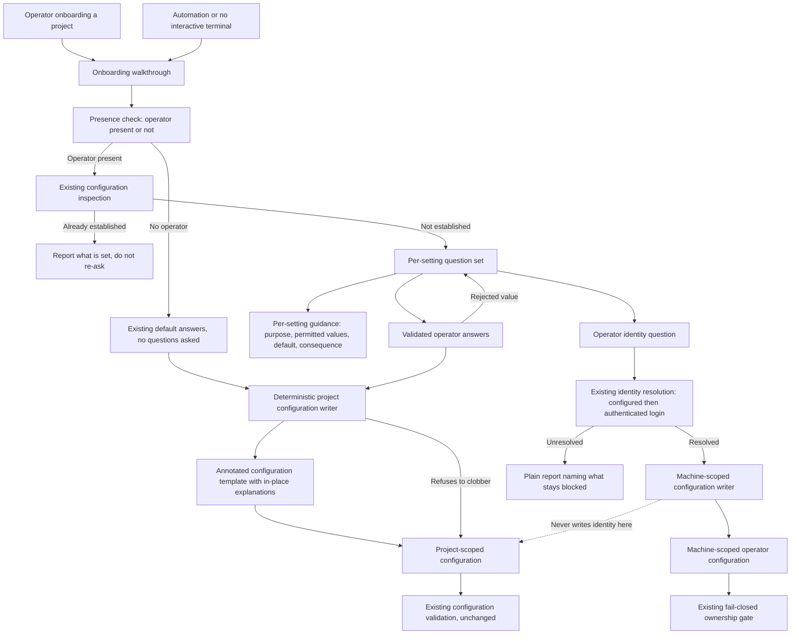

# Components: Guided setup walks the operator through project and operator configuration

**Last updated:** 2026-09-14
**Scope:** Proposed extension of the existing onboarding walkthrough and the deterministic
configuration writer for jstoup111/ai-conductor#2218; Medium tier. No new service, no new process,
no new transport, no database, and no change to configuration load, merge, or validation at run time.

## Diagram

## Legend

- Boxes are responsibilities, not a requirement for one new file per box.
- The walkthrough asks; it never composes configuration files itself. Every written value passes
  through a deterministic writer, which is the single writer for each configuration scope.
- The dotted edge is a prohibition, not a flow: operator identity is machine-scoped and is never
  written into project-scoped state shared through the repository
  (adr-2026-07-01-machine-scoped-operator-identity D1, D2). A validation rule already rejects it
  there, and that rule is unchanged.
- Presence check is the existing interactive-versus-automatic distinction. With no operator present
  the walkthrough asks nothing and records today's defaults, so automated and daemon paths keep
  their current behavior.
- Existing configuration inspection is what makes a re-run safe: an established value is reported,
  not re-asked and not rewritten. The writer's existing refusal to overwrite remains the backstop.
- Guidance is attached to the question for settings that are asked about, and to the template for
  settings that are not, so an operator reaches an explanation in either path without leaving the
  flow.
- Answer rejection loops back to the same question. An impermissible value is never recorded, so a
  configuration the harness would later reject cannot be produced here.
- Project registration and project creation are deliberately absent: they stay thin, non-interactive
  single-writer commands (adr-003-registry-write-and-integration), and this feature adds no prompt
  to either.

## Event-Spine Decision

Channel? No. Step 1 of the event-spine procedure stops here: this design adds no watcher, no poller,
no sidecar file, no bespoke log, and no timestamp stamped into an artifact for a later reader to
reconstruct timing.
Concern: Configuration is durable state — it answers "what is true now" and is read by name — not an
occurrence in time (exception C).
Verdict: No `ConductorEvent` variant is added and no ledger is introduced. The existing spine is
untouched.
Exception: C applies to the configuration artifacts themselves. Nothing here reconstructs occurrences
by polling configuration.

## Change Log

| Date | Change | Reason |
|------|--------|--------|
| 2026-09-14 | Initial generation | Authored during DECIDE for jstoup111/ai-conductor#2218 |
