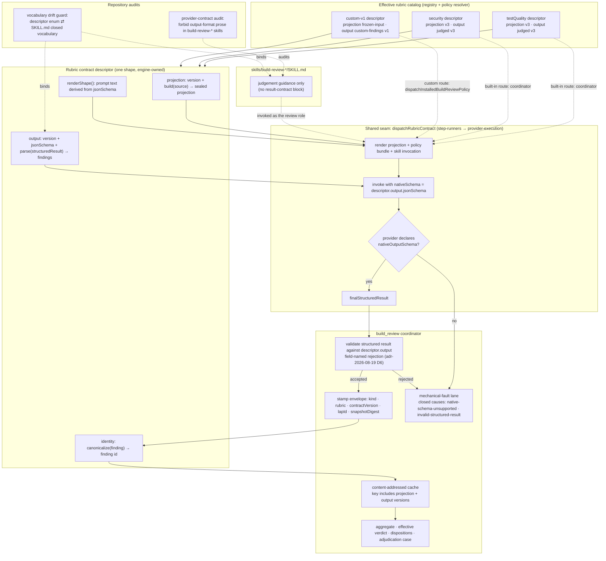

# Components: one rubric contract descriptor for every build_review catalog member

**Last updated:** 2026-09-22
**Scope:** The engine-owned rubric contract descriptor that `testQuality`, `security`, and the
custom-policy `custom-v1` member each fill in, and the single generic dispatch path that consumes
it. Judgement semantics, finding identity, dispositions, and the mechanical-fault lane are unchanged
in meaning; what changes is that one seam produces the projection, the native output schema, the
validated structured result, and the stamped envelope for every member.

## Diagram

## Legend

- **Effective rubric catalog** — the closed registry (`BUILD_REVIEW_RUBRIC_REGISTRY`) plus custom
  members admitted by the portable policy resolver (adr-2026-09-10). Each member supplies exactly
  one descriptor; nothing else about the member is consulted at dispatch.
- **Rubric contract descriptor** — the new engine-owned type. `projection` replaces the per-rubric
  branches inside `deriveBuildReviewRubricProjections`; `output.jsonSchema` is the JSON Schema
  handed to the provider natively and the single source from which both the prompt shape and the
  rejection diagnosis are rendered; `identity` wraps the existing `custom-v1` and built-in
  canonicalizers unchanged.
- **Shared seam `dispatchRubricContract`** — replaces the two scrape-and-parse paths (built-in
  `dispatchBuildReviewRubric` and the custom-policy dispatch). Built-in members reach it through the
  built-in-keyed coordinator; `custom-v1` reaches it through `dispatchInstalledBuildReviewPolicy`
  (ADR D1.3). Both routes share one render, one native-schema request, and one parser. `extractJudgedResultCandidate` and
  the bounded repair turn are retired; the provider's terminal structured result is the only input
  to validation.
- **Mechanical-fault lane** — existing lane (adr-2026-08-18-mechanical-rubric-faults) with two
  additional closed causes. Both settle `absent`, charge no kickback, and tick no cap.
- **Dotted edges** — audits and the skill invocation are not on the data path. The audits bind the
  descriptor's closed vocabulary to the skill text in both directions and fail the harness
  integrity suite when a build-review skill regains result-format prose.

## Change Log

| Date | Change | Reason |
|------|--------|--------|
| 2026-09-22 | Initial generation | Spec for #2384 — typed, structurally keyed rubric output on one descriptor seam |
| 2026-09-23 | Name `dispatchRubricContract` as the shared seam; show built-in and custom routes | ADR D1.3 clarification after as-built AB-1 |
