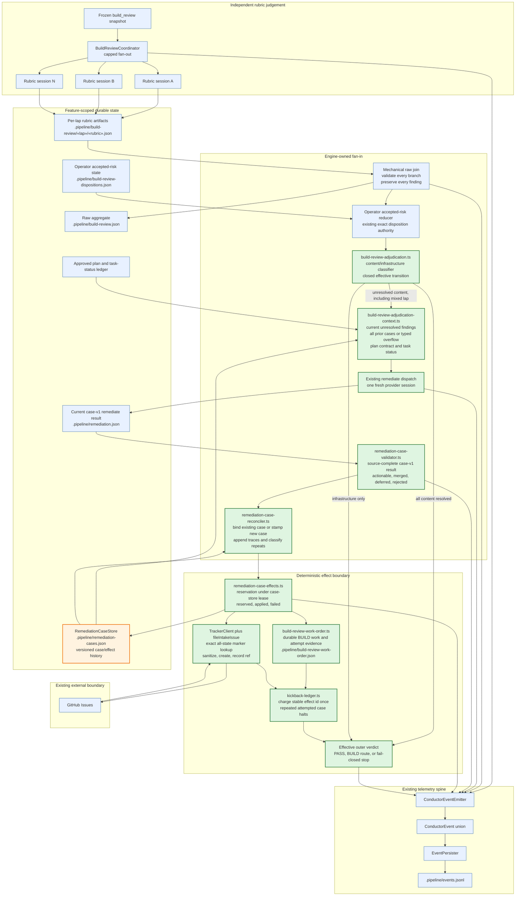

# Components: build_review fan-out and shared remediate fan-in

**Last updated:** 2026-08-29
**Scope:** Proposed component boundaries for jstoup111/ai-conductor#2033: independent rubric
judgements, one mechanical raw join, one existing `remediate` judgement over current and prior
outcomes, durable case history, deterministic effects, and one effective gate decision.

## Diagram



## Boundary decisions shown

- Rubrics remain independent and never receive sibling findings, prior adjudication history, or
  operator dispositions. Their write-disjoint artifacts remain raw evidence.
- The raw join is mechanical and source-preserving. A below-allowance infrastructure fault keeps the
  existing non-publishing lane. At exhaustion, the aggregate may publish for the existing operator
  reduced-coverage decision; content cannot continue until every infrastructure branch is exactly
  covered. The join never deduplicates semantic substance, assigns repair priority, files issues, or
  spends a semantic kickback allowance.

> **Amended 2026-08-29 by #2033:** the non-publishing rule applies to infrastructure-only laps. A
> mixed lap publishes current content and infrastructure together, sends only content to one
> `remediate` judgement, and retains infrastructure as an independent blocker. Exact operator reduced
> coverage remains the only non-healing path by which infrastructure can permit PASS.

- Existing operator risk acceptance is applied before autonomous synthesis and retains its separate
  authority. Autonomous `remediate` outcomes never become operator dispositions.
- One existing `remediate` dispatch receives every current unresolved content finding together with
  every feature-local prior case in a structurally and byte-bounded context, plus mechanically
  derived resolution evidence. It does not re-audit the source tree. Overflow fails closed rather
  than silently dropping old cases.
- The result validator requires exactly one traceable outcome for every raw source finding. Merge
  references must resolve, contradictory routes are invalid, and an actionable outcome must carry
  dispatchable work.
- Engine machinery stamps durable case identities, reserves external effects, publishes a durable
  BUILD work order or deferred intake, updates effect status, and decides budget/routing. The work
  order is retry context only: `build_review` does not append to the approved plan. Provider output
  never performs effects directly.
- A lap with one or more newly actionable cases consumes the existing `build_review` kickback once,
  regardless of how many findings were merged into the work order. A crash-interrupted effect may
  resume by its stable effect id without another charge. Once BUILD attempted the case, an equivalent
  unresolved finding halts with the prior case evidence instead of receiving a free route or being
  charged again.
- A mixed lap gives an admitted actionable content route precedence over the infrastructure retry for
  that transition. With no actionable content route, the uncovered infrastructure result follows its
  existing retry or exhaustion path. It can never be converted to PASS by case state.
- Any incomplete judgement, invalid result, unreadable history, or unapplied required effect is
  fail-closed and cannot publish PASS.

## Event-spine verdict

```text
Event spine
  Channel?    yes — adjudication start, completion, failure, and effect outcomes are occurrences
  Concern:    occurrence for lifecycle events; durable state for cases and current verdicts
  Verdict:    extend the ConductorEvent union; no bespoke telemetry format or reader
  Exception:  C for autonomous adjudication history and effect status
```

The autonomous history answers what is true about each adjudicated case now, including its source
finding references, outcome, effect reference, and resolution status. It is durable control state,
not an audit log reconstructed from timestamps. Every occurrence emitted while producing or
applying that state uses the existing event union and persister.

## Legend

- Blue nodes are existing components or artifacts reused by the design.
- Green nodes are changed control boundaries.
- Orange is new durable state, deliberately separate from operator accepted-risk authority.
- `«lap»` and `«rubric»` are runtime identifiers.

## Change Log

| Date | Change | Reason |
|------|--------|--------|
| 2026-08-29 | Initial proposed component diagram | DECIDE architecture input for issue #2033 |
| 2026-08-29 | Preserve content adjudication on mixed mechanical/content laps | Conflict-check resolution preserves the established mixed-lap contract |
| 2026-08-29 | Name planned modules and durable artifacts | Plan-update pass binds implementation tasks to architecture seams |
