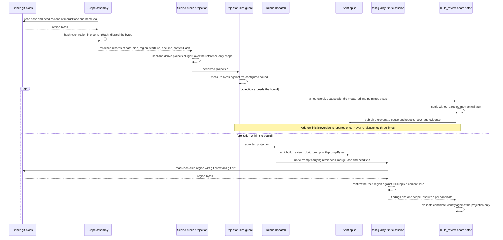

# Sequence: build_review testQuality evidence by reference with a projection-size guard

**Last updated:** 2026-09-17
**Scope:** Test-scope evidence assembly, sealed projection, the new projection-size guard, and rubric dispatch. Judgement semantics and scope selection are unchanged.

## Diagram

## Legend

- **Evidence is a reference, never a payload.** `BuildReviewPinnedScopeEvidence` keeps the region's
  identity (`source`, `region`, `startLine`, `endLine`, `contentHash`) and no longer carries the
  region's source bytes. This is the contract the graded diff already uses via `changedFiles`.
- **`contentHash` is unchanged and still derived from the same pinned bytes**, so the region's
  semantic identity, candidate matching, and finding anchors are untouched. Only the projected
  payload shrinks.
- **The grader re-reads what it cites.** It already runs inside the feature worktree and is already
  instructed to obtain diff content with `git show «mergeBase»:«path»` and
  `git diff «mergeBase»..HEAD -- «path»`; the same seam now serves evidence regions.
- **The size guard is measured, not guessed.** `build_review_rubric_prompt` already publishes
  `promptBytes` on the event spine, so the bound is checked against an observable the spine carries.
- **An oversize is a deterministic defect, not a transient fault.** It is reported once with a named
  cause and its measured bytes rather than consuming the shared mechanical-fault allowance across
  three identical laps.
- **No projection-version advance.** Cache correctness rides the existing
  `projectionDigest` comparison and the `engineIdentity.engineStamp` cache-key member; a shape
  change already misses closed on both.

## Change Log

| Date | Change | Reason |
|---|---|---|
| 2026-09-17 | Initial diagram. | Make the by-reference evidence contract and the projection-size guard explicit before implementation (#2582). |
