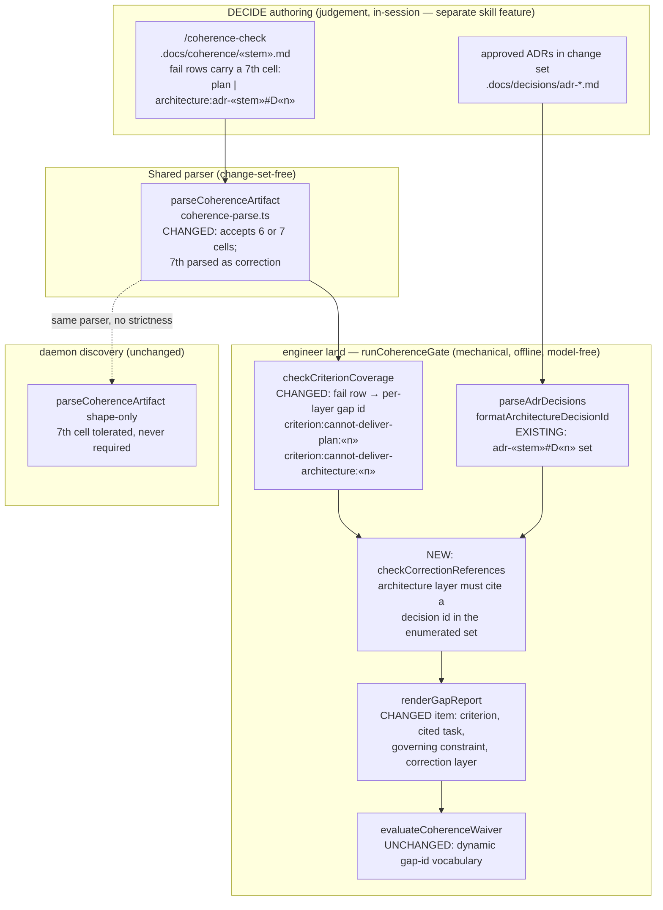

# Components: criterion correction-layer signal at land

**Last updated:** 2026-09-07
**Scope:** The land-time DECIDE surfaces changed by the engine half of jstoup111/ai-conductor#2419 —
an optional seventh `criterion` row cell carrying the correction layer, per-layer gap ids, and
validation of an `architecture` layer's cited ADR decision. Nothing in BUILD or SHIP changes.

## Diagram

## Legend

- `«…»` — variable placeholder (plan stem, criterion index, decision number).
- "NEW" marks a surface introduced by this feature; "CHANGED" marks an existing surface whose
  contract widens; "EXISTING"/"UNCHANGED" record reuse.
- The seventh cell is **optional in the grammar and required by the validator only when the row's
  verdict is `fail`**. Every existing six-cell artifact parses byte-for-byte as before, and a
  merged spec with zero criterion rows keeps building at discovery
  (adr-2026-08-23-criterion-layer-is-structural-at-land).
- The ADR decision set reused by the correction-reference check is the same one
  `validateArchitectureObligationCoverage` already enumerates from the change set's non-deleted
  ADRs — no second ADR parser, no second validity judgement
  (adr-2026-08-26-shared-coherence-parser-at-discovery, precedent for single-parser reuse).
- A malformed seventh cell (unknown layer word, `architecture` with no reference) is an
  `unparseable-criterion-row` parse defect and is never waivable; a well-formed `fail` row with a
  correction cell is a coverage gap and joins the existing waiver vocabulary
  (adr-2026-08-24-evidentiary-defects-are-not-waivable).
- No box in BUILD or SHIP appears because none changes: `prd_audit` PLAN_GAP keeps its
  needs-human halt; the correction layer is a DECIDE-time signal read by the operator in the land
  rejection and the spec PR diff.

## Change Log

| Date | Change | Reason |
|------|--------|--------|
| 2026-09-07 | Initial generation | DECIDE-phase design for the engine half of intake #2419 |
| 2026-09-07 | Verified against the 9-task plan; `checkCorrectionReferences` named as the correction-reference box, no structural change | Plan-update pass (/plan step 8b) |
