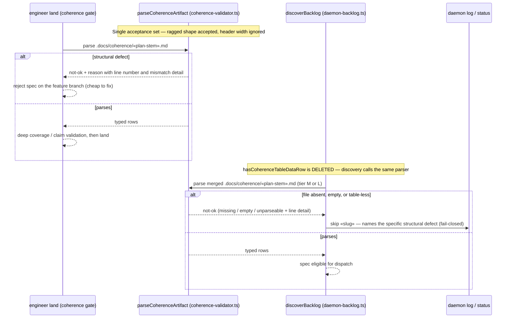

# Sequence: Shared coherence parsing at land and dispatch

**Last updated:** 2026-08-26
**Scope:** How one coherence-artifact parser (`parseCoherenceArtifact` in
`coherence-validator.ts`) becomes the single reader for both `engineer land` and daemon
dispatch discovery, replacing daemon-backlog's bespoke `hasCoherenceTableDataRow` triple-scan,
and how a structural parse rejection carries line-level detail to both surfaces.

## Diagram

## Legend

- **Land** — `engineer land`'s coherence gate, already a `parseCoherenceArtifact` caller.
- **Disc** — dispatch-time backlog discovery; after this change it consumes the shared parser
  instead of its own width-equality triple-scan, so land-accepted ⇒ dispatch-parseable by
  construction.
- «plan-stem» / «slug» — the feature's plan filename stem.
- The parser's failure result gains structural detail (offending line, expected vs actual
  cell count / row class) consumed verbatim by both rejection surfaces.

## Change Log

| Date | Change | Reason |
|------|--------|--------|
| 2026-08-26 | Initial generation | DECIDE for #1881 — unify the two divergent coherence readers |
