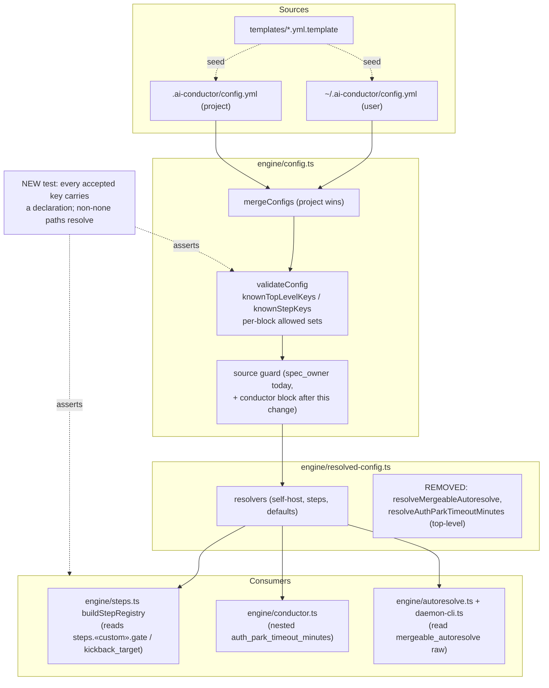

# Components: Config keys that validate but have no consumer (#1025)

**Last updated:** 2026-08-26
**Scope:** The config load→validate→resolve→consume pipeline touched by this feature — which keys
are removed, which validator sets change, and where the new coverage test sits.

## Diagram

## Legend

- **REMOVED** — dead surface deleted by this change: `defaults.by_tier` validator acceptance,
  `complexity.default_tier` (type + validator + template comments), `harness_self_host.skill_relink_preflight`
  (type + validator + resolver field), `resolveMergeableAutoresolve`, top-level
  `auth_park_timeout_minutes` (type + resolver; nested variant survives).
- **NEW** — `gate`/`kickback_target` added to `knownStepKeys`; `conductor` project-path guard;
  a registry coverage test proving every accepted key carries a declaration and every non-`none`
  declaration names a production module path that resolves on disk. It does not prove runtime reachability.
- «custom» — any operator-defined step name.

## Change Log

| Date | Change | Reason |
|------|--------|--------|
| 2026-08-26 | Initial generation | DECIDE for #1025 |
