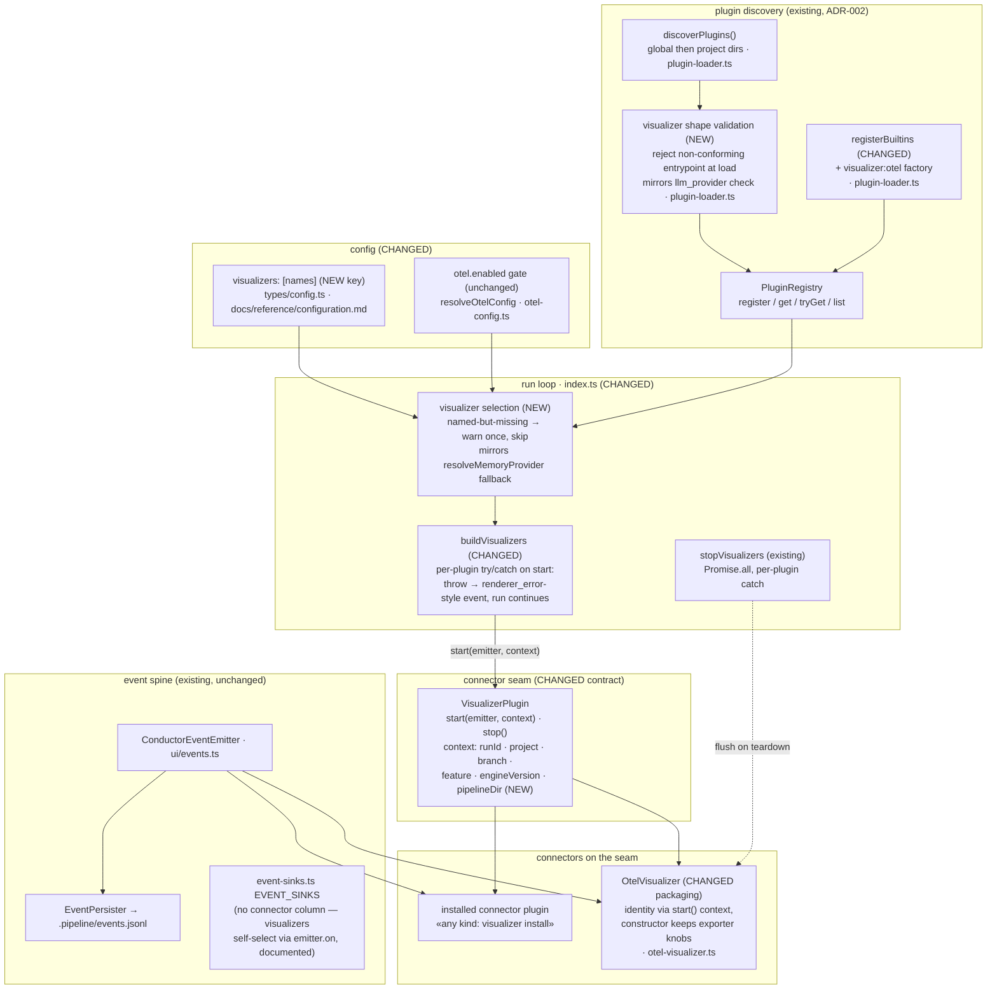
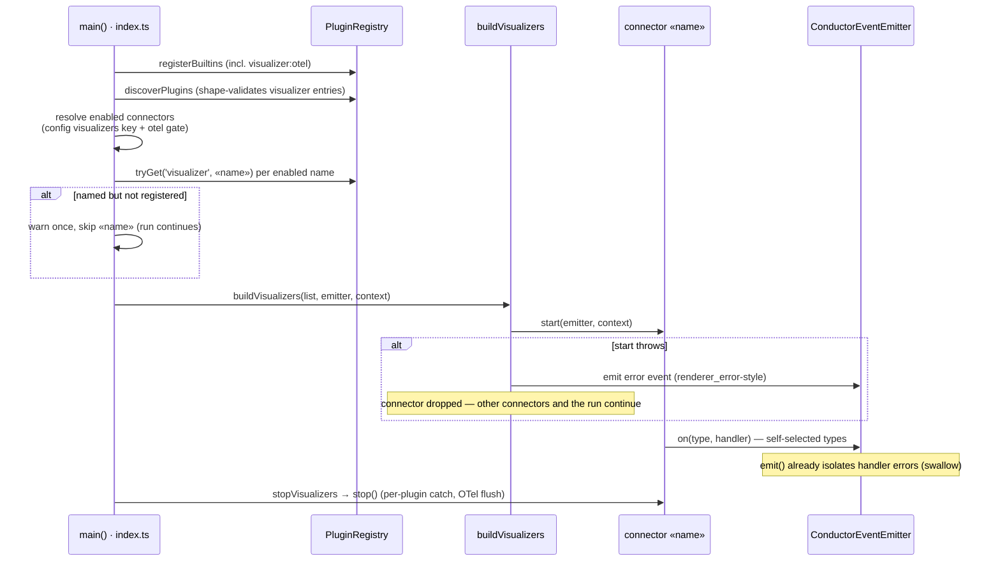

# Architecture: Connector Seam — Visualizer Selection Loop (finishes ADR-014)

**Last updated:** 2026-08-26
**Scope:** Wiring the registered-but-never-started `visualizer` plugin kind into the run loop —
registry selection mirroring `ui_renderer`, the built-in OTel exporter re-registered through the
same seam, an identity context on `start()`, error isolation so no connector can fail the run,
a config enablement key, and load-time shape validation. Consumed by `/architecture-review`.
**Source:** jstoup111/ai-conductor#1516; ADR-014 (otel-observability-exporter), ADR-002, ADR-003.

---

## Component view — selection loop and seam (changed vs existing)

## Sequence — startup selection and isolated failure

## Legend

- **NEW / CHANGED** markers name the delta; everything else is existing behavior left intact.
- `«name»` — placeholder for a configured connector name.
- Error-isolation rule mirrors ADR-003 (ui_renderer): a failing plugin never poisons the others
  or the run. Named-but-missing resolution mirrors `resolveMemoryProvider` (warn once, skip).
- The sink registry deliberately gains no connector column: connectors self-select event types
  via `emitter.on`, and that divergence is documented rather than reconciled (Approach B rejected
  in `.memory/decisions/connector-seam-approach.md`).

## Change Log

| Date | Change | Reason |
|------|--------|--------|
| 2026-08-26 | Initial generation | DECIDE for #1516 — finish ADR-014's selection loop |
