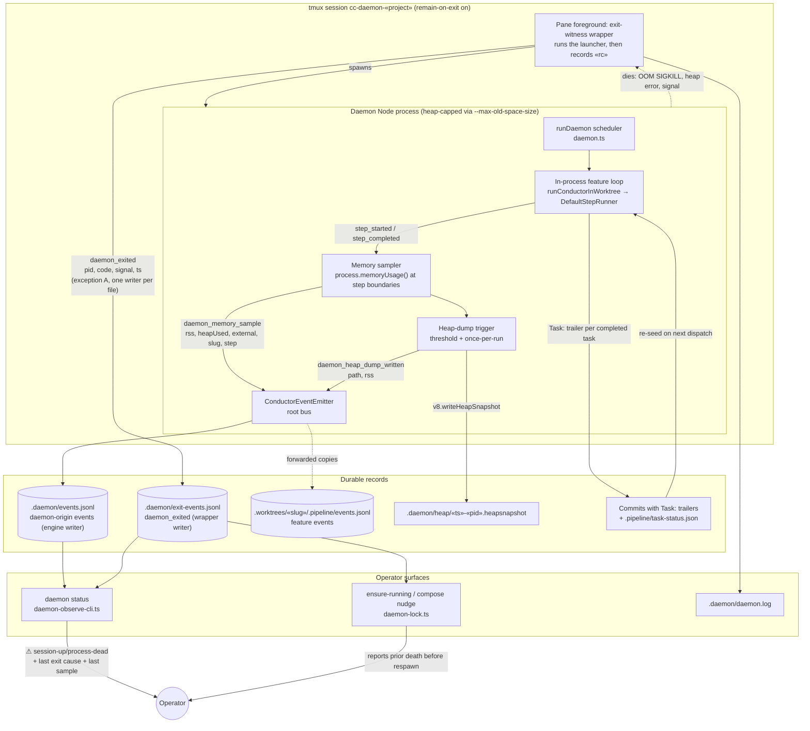
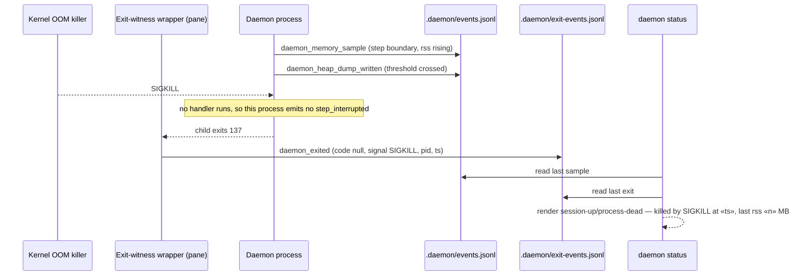

# Components: Daemon memory observability and exit attribution

**Last updated:** 2026-09-22
**Scope:** How the continuous daemon's own memory is sampled onto the event spine, how a heap
dump is captured before the host's ceiling, how a death from an external signal is witnessed
from outside the dying process, and how `daemon status` / `ensure-running` read those records.
The memory-growth fix itself is out of scope (follow-on intake once dumps identify the cause).

## Diagram

## Sequence: OOM kill mid-build

## What changes

**Memory becomes an occurrence on the spine, not a channel.** A `daemon_memory_sample` event
is emitted from the in-process loop at every step boundary (the sampler subscribes to
`step_started`/`step_completed` on the root bus). It carries `process.memoryUsage()` fields plus
the slug and step so the growth curve can be attributed to dispatch count versus wall clock — the
question the filer said to answer before designing a fix. Persisted by the existing
`startDaemonEventPersistence` path; no new file, poller, or sidecar. No OpenTelemetry instrument.

**A heap dump lands before the ceiling.** When a sample crosses a configured RSS threshold the
trigger writes one V8 heap snapshot under `.daemon/heap/` (once per run; bounded retention) and
emits `daemon_heap_dump_written` naming the path. The snapshot is durable state (exception C);
the event is the occurrence.

**The heap is capped.** `DAEMON_FOREGROUND_COMMAND` gains `--max-old-space-size`, so runaway
growth becomes a Node heap error with a stack in `.daemon/daemon.log` instead of a host-wide OOM.

**Death is witnessed from outside.** The pane foreground becomes a thin wrapper that runs the
launcher as its single child and, on its exit, appends a `daemon_exited` record (code, signal,
pid, timestamp) to `.daemon/exit-events.jsonl`. This is event-spine **exception A** (a separate
OS process with no bus access) and, per the one-writer-per-ledger rule
(`adr-2026-08-08-pipeline-owned-closeout-timestamps` D2,
`adr-2026-08-09-hook-owned-containment-event-ledger` E2), the wrapper owns a sibling file
rather than sharing `.daemon/events.jsonl` with the engine. The schema is a `ConductorEvent`
variant and readers merge by timestamp. `remain-on-exit` already keeps the pane; the wrapper
adds the attribution the pane cannot give. `daemon status` and `ensure-running` read the latest
`daemon_exited` and render the cause next to `session-up/process-dead`, so an OOM is never
described only by a later `execution interrupted` line. Governed by
`adr-2026-06-29-daemon-supervisor-port-and-attachable-hosting` D8–D10 (amended 2026-09-22).

**Resume is verified, not built.** Task re-seed from `Task:` trailers and `task-status.json`
already exists; this feature adds the negative-path story and the runbook entry for "daemon died
abruptly, no HALT", and proves the worktree `.pipeline/` evidence survives.

## Component responsibilities

| Component | Responsibility | Changed |
| --- | --- | --- |
| `types/events.ts` | `ConductorEvent` union | Yes — `daemon_memory_sample`, `daemon_heap_dump_written`, `daemon_exited` |
| `engine/event-sinks.ts` | Per-type sink policy | Yes — persist-only rows for the three variants |
| `engine/daemon-memory.ts` (new) | Sample at step boundaries; threshold heap dump | New |
| `engine/daemon-tmux.ts` | `DAEMON_FOREGROUND_COMMAND`, spawn/respawn | Yes — heap cap + exit-witness wrapper |
| `daemon-cli.ts` | Daemon composition root; `exit-witness` subcommand | Yes — wires sampler; adds the witness writer |
| `engine/daemon-observe-cli.ts` | `daemon status` rendering | Yes — reads last `daemon_exited` + last sample |
| `engine/daemon-lock.ts::ensureRunning` | Respawn entry | Yes — reports the prior death it is recovering from |
| `docs/runbooks/daemon-recovery.md` | Operator recovery | Yes — abrupt-death entry |

## Boundaries this change does not cross

- No fix for the growth; no per-dispatch child-process isolation; no OTel gauge.
- Engine-origin events keep flowing to `.daemon/events.jsonl`; the only new file is the
  wrapper-owned `.daemon/exit-events.jsonl`, in the same `ConductorEvent` schema.
- No change to `adr-010` pidfile liveness or the stale-engine respawn ADRs; the witness only
  records why the pid vanished.
- No change to task re-seed semantics.

## Legend

Solid arrows: data or control flow. Dotted arrows: process death or forwarded copies. Cylinders:
append-only ledgers. `« »`: variable part of a path or label.

## Change Log

| Date | Change | Reason |
|------|--------|--------|
| 2026-09-22 | Initial generation | DECIDE for #2079 |
| 2026-09-22 | `daemon_exited` moved to wrapper-owned `.daemon/exit-events.jsonl` | architecture-review F1: one writer per ledger file |
