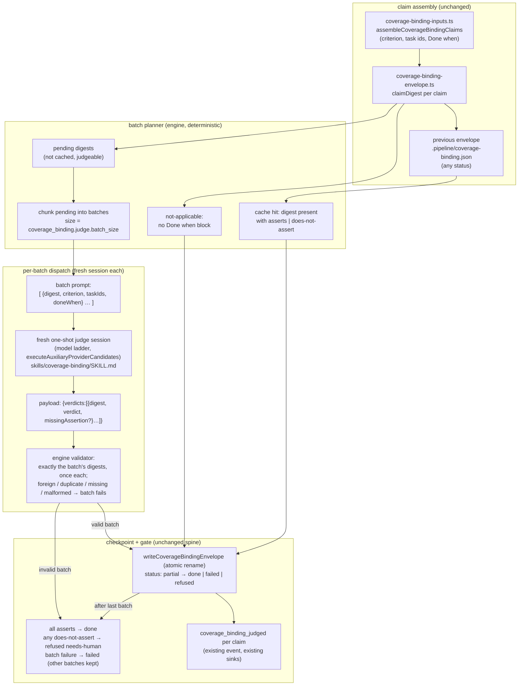
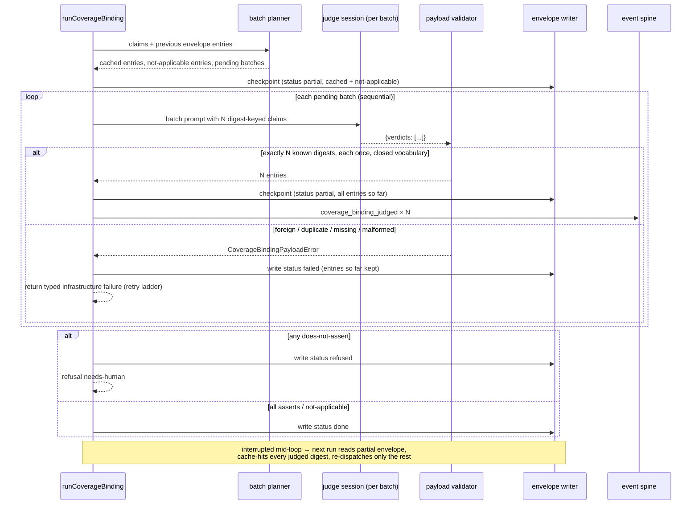

# Components + Sequence: batched coverage-binding judge with per-batch checkpoints (#2493)

**Last updated:** 2026-09-18
**Scope:** how `coverage_binding` dispatches its judge after this change. Claims are chunked into
bounded batches; one fresh provider session judges a batch and returns verdicts keyed by the
engine-stamped claim digest; the engine validates cardinality and identity, then atomically
rewrites `.pipeline/coverage-binding.json` after every batch so an interrupted run resumes from
the last checkpoint and re-dispatches only unjudged or invalid digests. Amends
`adr-2026-08-31-coverage-binding-judge-step` D5 (one session per claim → one session per batch).

## Diagram

## Legend

- **batch planner** — pure function over `(claims, previous envelope)`. It partitions claims into
  cached (digest already carries a judge verdict, whatever the envelope's status), not-applicable
  (D8 legacy tolerance), and pending, then chunks pending into batches of at most
  `coverage_binding.judge.batch_size`. Cache hits are honored from `partial` and `failed`
  envelopes as well as `done`; identity is still the D5 digest of `(criterion, Done when)`.
- **batch prompt / payload** — the judge receives an array of claims each carrying its engine
  stamped digest and must return one verdict per digest. The digest is the only key the engine
  accepts; verdict vocabulary stays `asserts | does-not-assert` + `missingAssertion`.
- **validator** — machinery, not judgement: the returned digest set must equal the batch's digest
  set exactly (no missing, no extra, no repeats) and every verdict must parse. Any deviation is
  the existing `CoverageBindingPayloadError` infrastructure-failure lane (retry ladder, never a
  verdict, never `needs-human`). Valid verdicts for unrelated claims in earlier batches are never
  discarded by a later batch's failure.
- **checkpoint** — `writeCoverageBindingEnvelope` already writes atomically via sibling temp file
  + rename. The change is *when*: after every batch, with a new `partial` status that is not in
  `COVERAGE_BINDING_COMPLETION_STATUSES` (so a killed run never counts as done). `done`, `failed`,
  `refused`, `disabled` keep their meaning.
- **spine** — no new event types. `coverage_binding_judged` is still emitted per claim; batches
  are an execution shape, not a new observable concern.

## Change Log

| Date | Change | Reason |
|------|--------|--------|
| 2026-09-18 | Initial generation | DECIDE for #2493 (approach B, bounded batches + per-batch checkpoint) |
| 2026-09-18 | Plan-update pass: planner extracted to `coverage-binding-batches.ts`, batch parser `parseJudgeBatchPayload` in the envelope module; no diagram node change | /plan §8b for #2493 |
