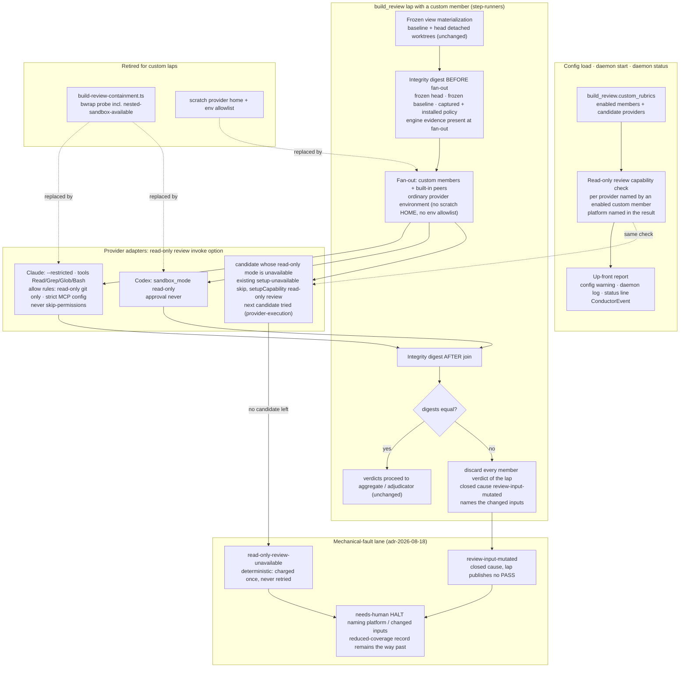

# Components: custom build_review laps run in provider read-only review mode with detect-and-discard

**Last updated:** 2026-09-24
**Scope:** How a `build_review` lap that includes an enabled custom rubric protects its review inputs
on every platform. The per-lap bubblewrap containment boundary (probe, mount profile, scratch
provider home, env allowlist) is retired. Protection moves to three things: each provider's own
read-only review mode, an engine-owned integrity digest of the lap's inputs taken before fan-out
and checked after the join, and a host capability check that reports an unavailable read-only mode
before any review fault is spent. Built-in-only laps, ordinary BUILD, and non-review steps are
untouched.

## Diagram

## Legend

- **Read-only review mode** is an engine-owned invoke option that each provider adapter maps to its
  native mechanism. It is provider-enforced, not OS-proven. Reads of host state and sibling evidence
  are limited only by the provider's tool set (adr-2026-09-10-portable-build-review-policy D5 as
  amended by this feature).
- **Integrity digest** is engine evidence under the lap's existing build-review evidence root. It
  catches a write that gets past a provider's read-only mode. Because members share one frozen view
  and run concurrently, a mismatch cannot be attributed to one member, so the whole lap is discarded.
- **Capability check** runs the provider's own read-only mechanism once and observes both sides: a
  process can start, and a write is refused. The result names `process.platform` and the reason.
  There is no hand-written platform table.
- Dotted edges show what replaces the retired components.

## Change Log

| Date | Change | Reason |
|------|--------|--------|
| 2026-09-24 | Initial generation | #2735 DECIDE: detect-and-discard replaces bubblewrap review containment |
| 2026-09-24 | Plan update: setup-unavailable skip path, Claude read-only git allow rules, digest excludes the feature checkout | /plan and conflict-check resolutions |
