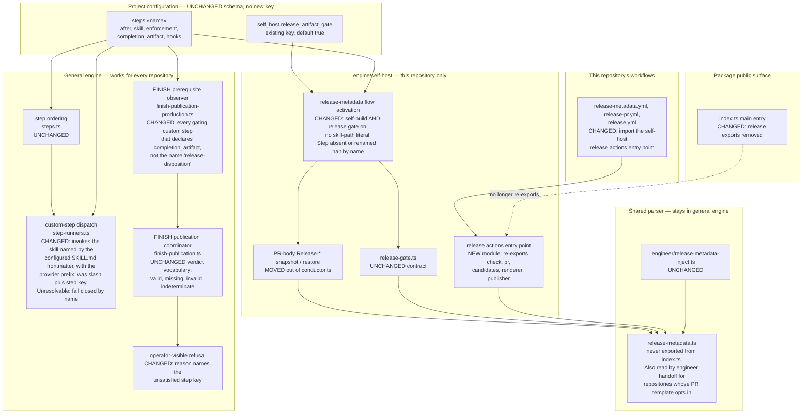
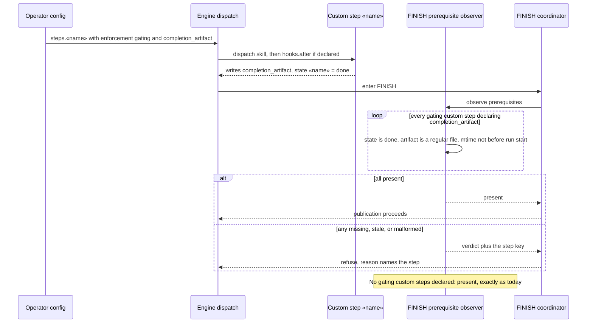

# Components: Custom steps without engine-reserved names or paths (#1344)

**Last updated:** 2026-09-20
**Scope:** The four places the engine binds custom-step behavior to this repository — the FINISH
release-readiness observer (`finish-publication-production.ts:137-158`), the
`releaseDispositionFlowActive()` predicate and its four call sites (`conductor.ts:2789`, `:6336`,
`:6542`, `:6594`, defined `:6355`), custom-step prompt construction (`step-runners.ts:828-836`),
and the release modules re-exported from the package entry
point (`index.ts:5-9`) — plus the three GitHub Actions workflows that import them
(`release-metadata.yml:36`, `release-pr.yml:68`, `release.yml:47,163`). Generic custom-step
declaration, ordering, dispatch, `hooks`, and enforcement (`types/config.ts:104-126`,
`engine/hooks.ts`) are shown only as the unchanged baseline the change relies on.

## Diagram

## Sequence: FINISH prerequisite for a consumer's gating custom step

## Legend

- **UNCHANGED / CHANGED / MOVED / NEW** mark the delta this spec introduces; unmarked edges exist
  today.
- **General engine** is code every consuming repository runs. **engine/self-host** is code that
  only executes for this repository's self-build; after this change it is the only place that
  knows the step name `release-disposition` or the `Release-*` field names at runtime.
- **Shared parser.** `release-metadata.ts` is not part of the move: it has never been on the
  public surface, and the engineer handoff path reads it for any registered repository whose
  `.github/pull_request_template.md` opts in. The architecture review confirmed it stays in the general
  engine.
- **Public surface** is `package.json` `main` → `dist/index.js`; the package declares no
  `exports` map, so the entry point's re-exports are the whole advertised API.
- Out of scope and absent from the diagram: step packages and installed step identity (#2615),
  PR-body customization for custom steps (#2616), and `runShipmentReconcileAction`, a
  workflow-only export of the same class that #1344 does not list.
- Guillemets mark placeholders (`«name»`).

## Change Log

| Date | Change | Reason |
|------|--------|--------|
| 2026-09-20 | Initial generation | DECIDE for #1344, Tier M |
| 2026-09-20 | Added the custom-step dispatch component | Architecture review found dispatch keyed on the step name; operator added it to scope |
