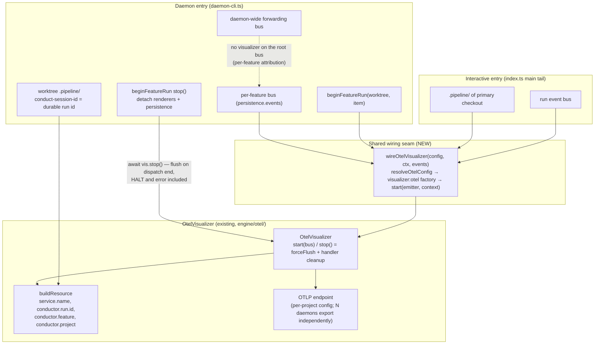

# Components: Daemon OTel wiring via shared visualizer seam

**Last updated:** 2026-08-26
**Scope:** How the OTel visualizer reaches BOTH entry points — interactive `main()` and the
daemon's per-feature dispatch — through one shared wiring seam, closing the gap where
`daemon-cli.ts` built its own buses with no visualizer (#1934).

## Diagram

## Legend

- **NEW** — the shared seam extracted from the interactive tail's inline block; both entry
  points call it, so a third entry point cannot silently omit the visualizer again.
- Per-feature attach: one visualizer per daemon dispatch, on the feature-scoped bus, with the
  worktree's `.pipeline/` as `pipelineDir` — `conductor.run.id` resolves to the durable
  `conduct-session-id`, so re-dispatches of the same feature in later daemon processes stitch
  by run id (per-dispatch traces, shared identity).
- Disabled/absent OTel config → `wireOtelVisualizer` returns null; daemon behavior unchanged.
  Unreachable endpoint → `onWarning` bridges to a `renderer_error` event (bounded warning).

## Change Log

| Date | Change | Reason |
|------|--------|--------|
| 2026-08-26 | Initial generation | DECIDE for #1934 (daemon emits no OTel) |
