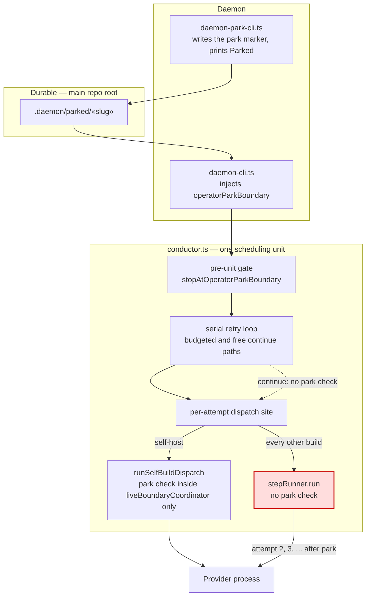
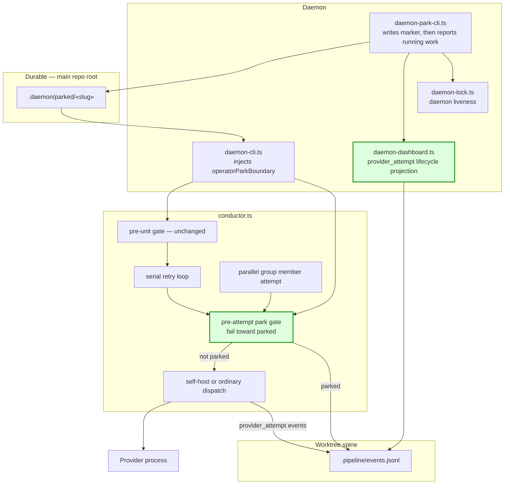
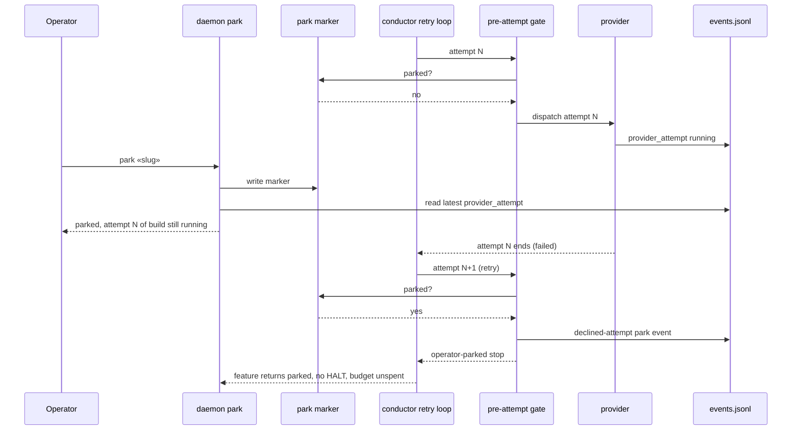

# Components: Park honored at every provider dispatch

**Last updated:** 2026-09-22
**Scope:** How the daemon-injected operator-park predicate reaches each provider dispatch inside a running
step, and how `daemon park` reports whether work is still running for the slug. Covers intake
`jstoup111/ai-conductor#2103` and PRD `.docs/specs/daemon-park-does-not-stop-retries-inside-an-alread.md`.

## Current state (defective)

The park predicate is consulted before each scheduling unit (serial step or parallel group), plus
before a self-host dispatch. The serial retry loop re-enters the dispatch site on every `continue`.
Only the self-host branch checks park there, so an ordinary build keeps launching attempts after a
park.

## Target state

One pre-attempt park check sits at the per-attempt dispatch seam, above the self-host/ordinary fork.
It covers every serial attempt, budgeted or free, and every parallel-group member attempt. A declined
attempt returns the existing typed operator-parked stop and emits a spine event. `daemon park` reads
the feature's persisted provider-attempt events through the dashboard projection that already exists,
and reports running, stopped, or unknown.

## Sequence: park lands mid-step

## Legend

- Red node: the defect. `stepRunner.run` is reached on every retry with no park check.
- Green nodes: new or newly reused components.
- «slug»: the feature slug placeholder.
- The pre-unit gate from ADR 2026-07-29 is unchanged. The new gate adds a check inside the unit and
  still drains the attempt that is already running (FR-2).

## Change Log

| Date | Change | Reason |
|------|--------|--------|
| 2026-09-22 | Initial generation | #2103: park must stop in-step retries |
| 2026-09-22 | Plan update: no structural change | Plan tasks 1–13 match the target-state components; the group member gate is the `parallel group member attempt` node |
