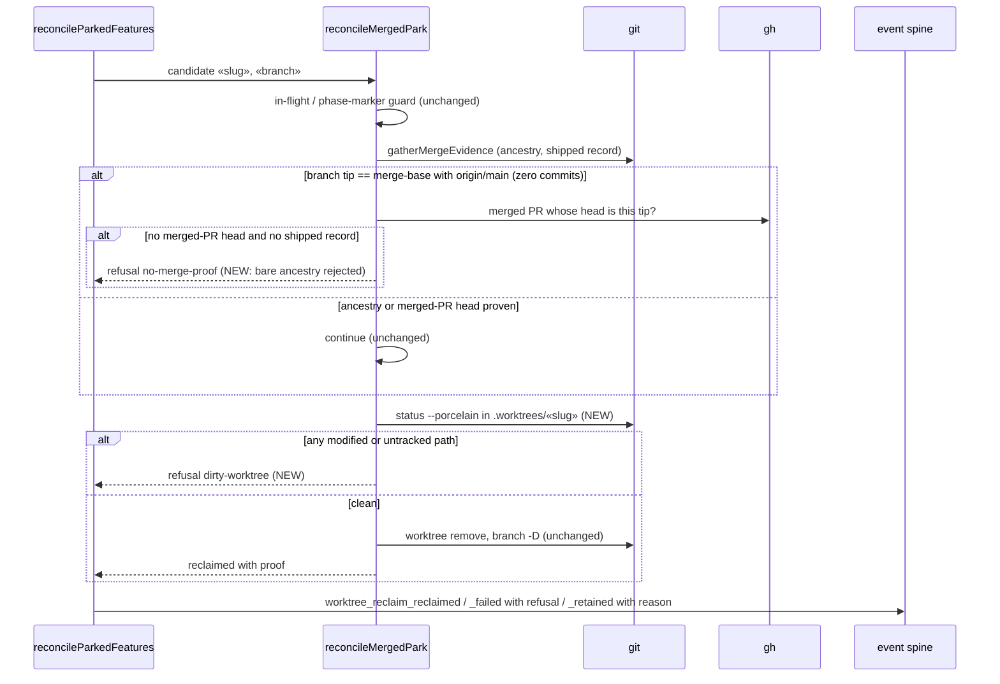

# Sequence: Reclaim sweep retains dirty and zero-commit worktrees

**Last updated:** 2026-09-21
**Scope:** `reconcileMergedPark` in `src/conductor/src/engine/park-reconciliation.ts`: the guarded delete helper the merged-worktree reclaim sweep (#2574) calls for each candidate. Covers the two new guards from #2636.

## Diagram

## Legend

- **NEW** marks the #2636 guards; everything else is the current behaviour.
- The dirty-tree check runs after merge proof and immediately before the destructive step, so a tree that becomes dirty during proof gathering is still caught.
- A refusal is reported through the existing `worktree_reclaim_failed` event and the sweep log line. No new channel.

## Change Log

| Date | Change | Reason |
|------|--------|--------|
| 2026-09-21 | Initial generation | #2636: sweep deleted a dirty zero-commit operator worktree |
