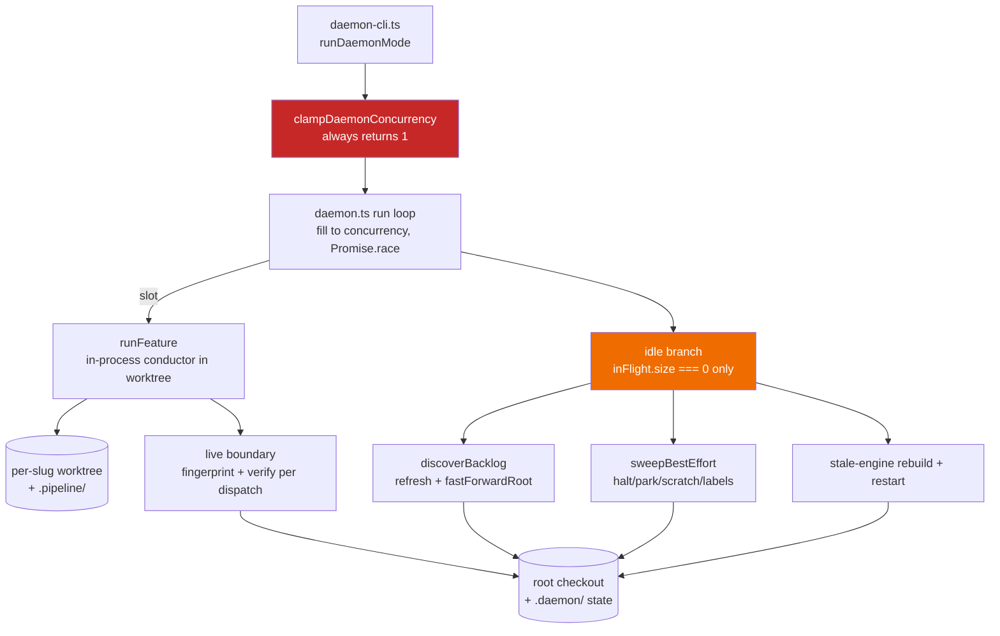
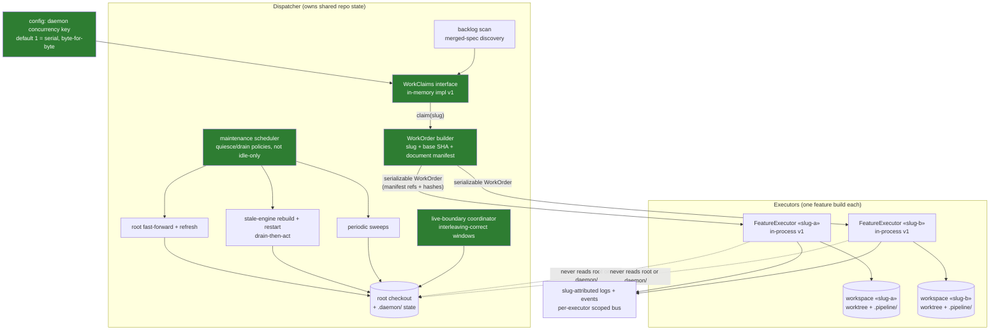

# Components: Daemon dispatcher/executor seam and N-worker un-clamp

**Last updated:** 2026-08-27
**Scope:** The daemon orchestration core affected by issue #568 — the worker pool in `engine/daemon.ts`, the concurrency clamp, the idle-gated shared operations, the self-host live boundary, and the new dispatcher/executor contract.

## Current architecture

The pool is already N-capable, but the clamp forces serial execution and every shared operation
(root fast-forward, backlog refresh, sweeps, stale-engine recovery, queued restarts) hides behind
`inFlight.size === 0` — correct at N=1, starvation at N>1. `runFeature` couples execution to the
daemon's own process state, root paths, and `.daemon/` files, so no dispatcher/executor boundary
exists.

## Target architecture

## Component responsibilities

| Component | Responsibility |
|---|---|
| WorkClaims | Claim/release lifecycle for feature slugs; dedup authority. Interface designed for a durable future implementation; v1 ships in-memory only (single process keeps it authoritative). |
| WorkOrder builder | Assemble a serializable work order: slug, repo identity, pinned base SHA, and a document manifest (spec/plan artifact refs + content hashes). Git-resolvable today; the contract does not require the documents to be in git. |
| FeatureExecutor | Execute exactly one work order in its own workspace. Process-separable contract; v1 implementation runs in-process (wraps today's `runFeature`). Never touches the root checkout or `.daemon/`. |
| Maintenance scheduler | Run shared root operations under explicit policies instead of the `inFlight.size === 0` gate: base-SHA pinning lets refresh/fast-forward run while executors are busy; stale-engine restart drains executors first. |
| Live-boundary coordinator | Dispatcher-side ownership of self-host fingerprint/verify windows, correct under interleaved executor dispatch boundaries (no cross-executor false halts). |
| Concurrency config key | Explicit operator opt-in; resolver + validation in the config allowlist; replaces the unconditional clamp. Default 1 preserves today's serial behavior byte-for-byte. |
| Slug-attributed logging | Extend the existing per-feature loggers/scoped event buses to the remaining unattributed sinks (process-level warn/error tee, global bus subscriber) so interleaved worker output stays triageable. |

## Legend

- Green nodes are new seams introduced by this feature.
- Red marks the clamp being removed; orange marks the idle-only gate being replaced with policies.
- Dashed arrows are prohibitions the seam enforces, not data flows.
- `«slug»` denotes a per-feature placeholder.

## Change Log

| Date | Change | Reason |
|---|---|---|
| 2026-08-27 | Initial current/target component flow | DECIDE architecture for issue #568 (dispatcher/executor seam + un-clamp, topology B destination) |
