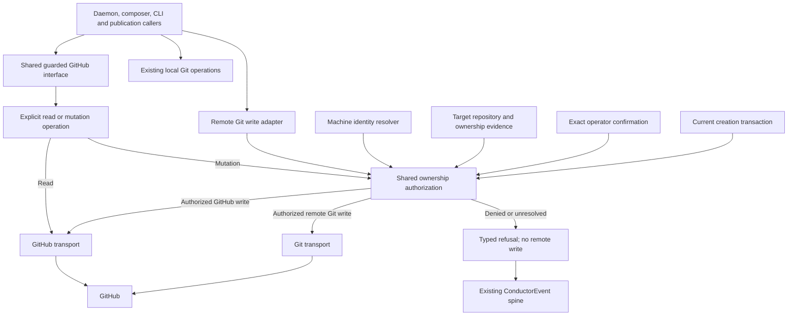
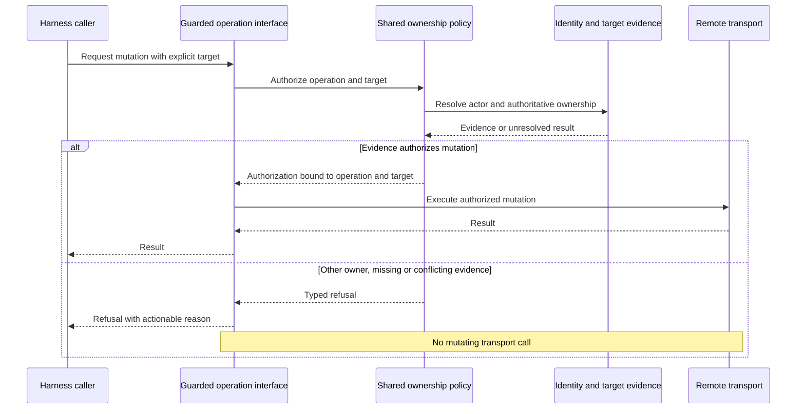

# Components and sequence: Harness GitHub ownership

**Last updated:** 2026-09-11
**Scope:** Enforcement boundary for #2516; diagram approved by the operator in chat on 2026-09-11. Resource policy approved in adr-2026-09-11-github-operation-ownership.

## Component diagram

## Mutation sequence

## Legend

Boxes are logical components inside the existing harness process, except GitHub.
The guarded GitHub interface extends the existing tracker-client runner boundary;
the remote Git adapter shares policy without absorbing local Git operations.
Authorization is about the target operator's work, not merely the authenticated
account's repository permissions. Ordinary reads support discovery and evidence gathering.

## Verified basis

- tracker-client.ts defines the canonical GhRunner and makeProductionGh factory.
- pr-labels.ts re-exports that GitHub runner and supplies a separate GitRunner.
- halt-pr-reconciliation.ts currently heals and clears marked PRs without ownership input.
- owner-gate/machine-identity.ts resolves machine-scoped identity; provenance.ts reads committed spec ownership.
- ship-draft-pr.ts performs remote publication through an injected Git runner.

## Decisions reserved for architecture review

The diagram fixes the approved boundary, not an unreviewed ownership matrix.
Review must define proof for existing features, pre-spec intake, new resources,
repository-wide resources, conflicting evidence, and retries. It must inventory
all production invocation paths, including provider-issued commands, before
claiming complete enforcement. No generic caller-supplied bypass is proposed.

> **Amended 2026-09-11 by #2516:** Architecture review and operator approval settled these points in adr-2026-09-11-github-operation-ownership D1-D8. The implementation plan assigns Tasks 1-6 to the operation/policy boundary, 7-17 to resource callers, 18-21 to remote Git/publication, 22 to guarded CLI/host dispatch, 23 to canonical refusal events, and 24 to the executable invocation audit. Exact operator confirmation and current creation-transaction evidence are shown explicitly above; neither is blanket authority. D8 preserves local GATED visibility while refusing foreign announcements.

## Event spine

Ownership refusal is an occurrence: use the existing ConductorEvent union, emitter,
and persister. No parallel log schema, watcher, or sidecar is introduced.
Design artifacts are durable state (exception C), not telemetry.

## Change Log

| Date | Change | Reason |
|------|--------|--------|
| 2026-09-11 | Proposed shared authorization boundary and refusal sequence | Operator-approved comprehensive scope for #2516 |
