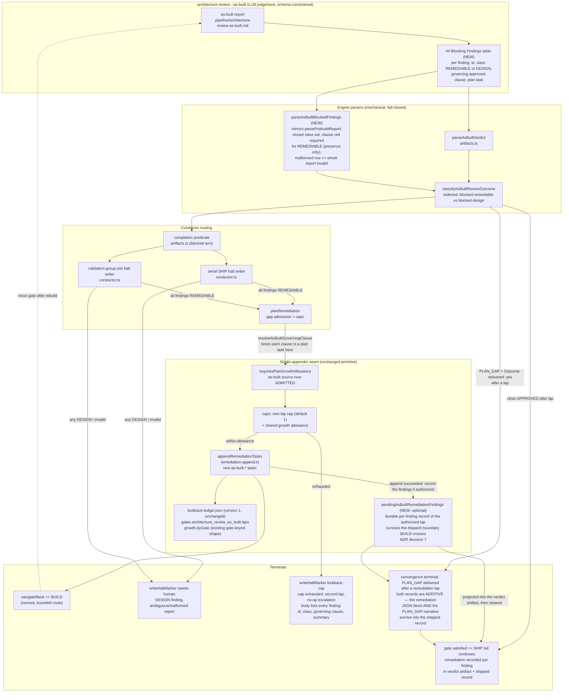

# Components: As-Built BLOCKED Per-Finding Classification and Bounded Remediation

**Last updated:** 2026-08-26
**Scope:** issue #1874 — classify each as-built BLOCKED finding (REMEDIABLE vs DESIGN) and
route REMEDIABLE findings through the existing single-appender remediation seam under a new
`architecture_review_as_built` gate key. DESIGN findings and an ambiguous or malformed
report halt `needs-human`; cap exhaustion, a second lap, and a no-op escalation halt
`kickback-cap` with every finding listed.

## Diagram

## Legend

- **NEW** marks new machinery; everything else is existing seams reused.
- Classification is an LLM verdict constrained by a closed schema (repo design principle);
  all bookkeeping (parsing, caps, ledger, halt) is mechanical and fail-closed.
- One appender preserved: as-built findings enter through the same `planRemediation` →
  `appendRemediationTasks` seam prd_audit uses, under their own gate key — no second appender.
- `pendingAsBuiltRemediationFindings` is the feature's only durable-state addition (ADR
  decision 7). It is optional, validated fail-closed, carries no ledger version bump, and is
  cleared by the same step that projects it — a pending entry never outlives its projection.
- The two record kinds are additive, never alternatives
  (`adr-2026-08-22-as-built-review-runs-always-with-plan-gap` D2): a lap can remediate
  REMEDIABLE findings AND deliver a PLAN_GAP, and the shipped record carries both. The reader
  selects the narrative `## Recorded Findings` section, never the projected JSON block, in
  whichever order they appear.
- Supersedes `adr-2026-08-22-as-built-review-runs-always-with-plan-gap` D3 (bounded revival of
  the as-built→build route) and amends `adr-2026-08-22-one-owner-per-review-question`'s
  appender clause.

## Change Log

| Date | Change | Reason |
|------|--------|--------|
| 2026-08-25 | Initial generation | DECIDE for issue #1874 |
| 2026-08-26 | Added the `pendingAsBuiltRemediationFindings` ledger node and its projection edge | Operator amendment approving ADR decision 7 (as-built finding AB-D1) |
| 2026-08-26 | Split the halt terminal into needs-human vs kickback-cap; moved clause binding off the parser | As-built drift notes: cap exhaustion is kickback-cap, and clause resolution happens in planRemediation |
| 2026-08-26 | Added the delivered-PLAN_GAP convergence terminal | AB-R10: a remediation lap and a delivered PLAN_GAP coexist, and both records are additive |
