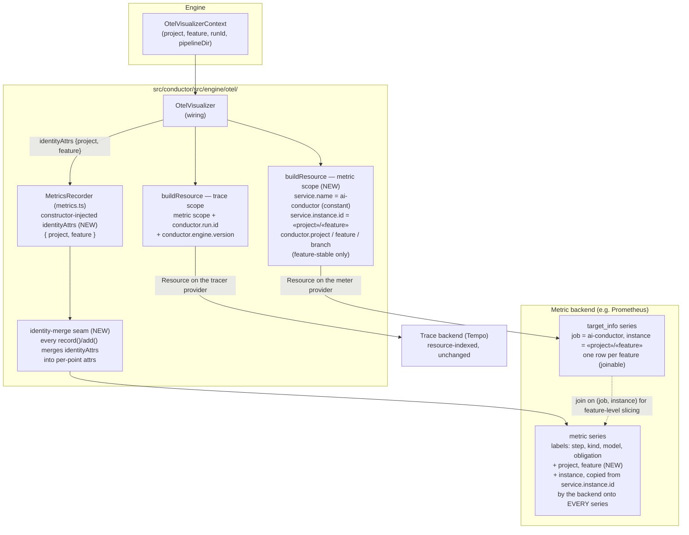

# Components: OTel two-layer identity (#1938)

**Last updated:** 2026-08-28
**Scope:** Identity propagation through `src/conductor/src/engine/otel/` — how project, feature,
and run id reach metric data points and the OTel Resource so metric backends can distinguish
projects and concurrent runs without collector rewriting.

## Diagram

## Identity contract (consumer-facing)

| Layer | Carrier | Values | Cardinality |
|-------|---------|--------|-------------|
| Service | `service.name` (resource) | constant `ai-conductor` | 1 |
| Instance | `service.instance.id` (both resources) | `<project>/<feature>` | 1 per feature; the backend copies it onto every metric series as `instance`, so it is never resource-only |
| Run | `conductor.run.id` (trace resource only) | resolved feature-run id | unbounded by design, and confined to traces — on the metric resource it would mint a `target_info` series per run |
| Dimensions | data-point attributes | `project`, `feature` | bounded (fleet size × features) |

- Cross-project totals: `sum(metric)` — no `by` clause needed; separation never forces per-project queries.
- Per-project/per-feature slicing: `by (project)` / `by (feature)` directly on data points.
- Feature-level slicing from resource attributes: join `target_info` on `(job, instance)`. The join needs a unique key per row, which is why `instance` must be the feature identity and not a constant.
- The run id is on no metric label path — not a data-point attribute, not `service.instance.id`, and not a metric resource attribute. `target_info`'s label set is the whole resource attribute set, so the metric resource carries only feature-stable values and that row is one series per feature.
- Traces: unchanged; `conductor.run.id` on the trace resource identifies the run, and the shared `service.instance.id` ties a trace to its feature's `target_info` row.

## Legend

- **(NEW)** — added by this feature; all other nodes exist today.
- The identity-merge seam is one code point inside `MetricsRecorder`, so instruments added
  concurrently (e.g. #1941's cost/dispatch counters) inherit `project`/`feature` automatically.

## Change Log

| Date | Change | Reason |
|------|--------|--------|
| 2026-08-26 | Initial generation | DECIDE for #1938 (two-layer OTel identity) |
| 2026-08-28 | `service.instance.id` re-keyed from the run id to `<project>/<feature>`; `instance` shown on every metric series | As-built finding AB-2: the backend copies `service.instance.id` onto every series, so a per-run value defeated the bounded-growth claim (adr-014 amendment 2026-08-28) |
| 2026-08-28 | Resource split by signal: feature-stable for metrics, run-identified for traces | Second as-built AB-2: `target_info`'s label set is the whole resource attribute set, so `conductor.run.id` kept minting a series per run after the instance re-key |
