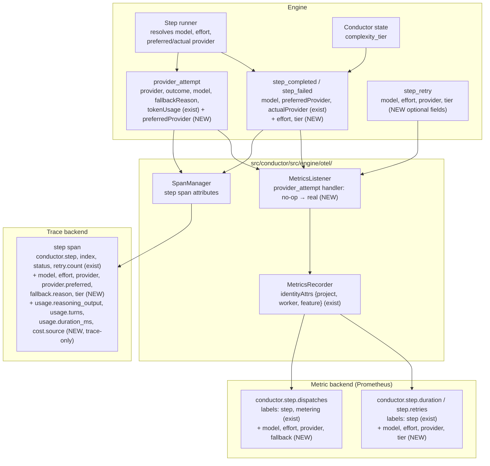

# Components: OTel dispatch dimensions (#1940)

> **Amended 2026-09-10 by operator:** The production topology remains one
> event-fed `MetricsListener` plus spans-only `OtelVisualizer` wiring. Provider
> attempt events carry preferred provider, resolved effort, and tier. Dispatch
> state retains dimensions needed by failed closure and retains an unavailable
> preferred-provider reason across later attempts so successful fallback spans
> export the reason without creating a second metric path.

**Last updated:** 2026-09-09
**Scope:** How the dimensions the engine already resolves per dispatch — provider and fallback, reasoning effort, complexity tier, model — and the unexported `TokenUsage` detail reach
metric data points and step spans through `src/conductor/src/engine/otel/`. Approach A: direct
plumbing through the existing event payloads and the two existing projections; no new instruments.

## Diagram

## Placement contract (label vs trace-only)

| Dimension | Source today | Placement | Bounded set | Why |
|-----------|--------------|-----------|-------------|-----|
| `model` | `step_completed.model`, `provider_attempt.model`, failed-attempt result on `step_retry` | label on duration, retries, dispatches; span attr | rate-card model set (~10) | the issue's "duration by model" question |
| `effort` | resolved per invocation in the runner; NEW on `step_completed` and `step_retry` | label on duration, retries, dispatches; span attr | 5 values | cost/latency effect of an effort change |
| `provider` | `step_completed.actualProvider`, `provider_attempt.provider`, failed-attempt actual provider on `step_retry` | label on duration, retries, dispatches; span attr | 2–3 values | Codex vs Claude attribution |
| `fallback` | `provider_attempt.preferredProvider !== provider_attempt.provider` | label on dispatches only (`true`/`false`); span attr | 2 values | fallback rate is a counter question, computed when the dispatch occurs |
| `fallback.reason` | `provider_attempt.fallbackReason` | span attribute only | free text | unbounded string — never a label |
| `tier` | `state.complexity_tier`; NEW on `step_completed` and `step_retry` | label on duration, retries, dispatches; span attr | 3 values | tier as a dimension |
| `usage.reasoning_output`, `usage.turns`, `usage.duration_ms` | `TokenUsage` | span attributes only | numeric | per-dispatch detail, not a slicing key |
| `cost.source` | `TokenUsage.costSource` | span attribute only (already a label on `feature.step.cost` as `source`) | 2 values | avoid duplicating the existing cost label |

Label growth bound: `step × model × effort × provider × tier × fallback` ≈ 20 × 10 × 5 × 3 × 3 × 2
= 18 000 theoretical, but each series exists only for a combination that actually dispatched; in
practice one model/effort pair per step per tier. `feature`, `project`, `worker` multiply as today.

## Legend

- **(NEW)** — added by this feature; all other nodes and fields exist on main today.
- `step_failed` carries the same new fields as `step_completed` so failed dispatches keep their
  dimensions on the duration histogram.
- Spec owner is deliberately excluded (operator decision 2026-09-09: privacy of "who" needs its
  own intake); no user identity leaves the process.
- Absent values are omitted from the attribute set, never filled with `unknown`, matching the
  existing `feature_cost_snapshot` handling of optional `model`/`source`.

## Change Log

| Date | Change | Reason |
|------|--------|--------|
| 2026-09-09 | Initial generation | DECIDE for #1940 (open dimension gaps; approach A) |
| 2026-09-09 | Plan-update pass: no structural change; `conductor.tier` renamed to the already-documented `conductor.complexity_tier` | conflict-check resolution; plan Tasks 1–10 map onto the (NEW) nodes as drawn |
