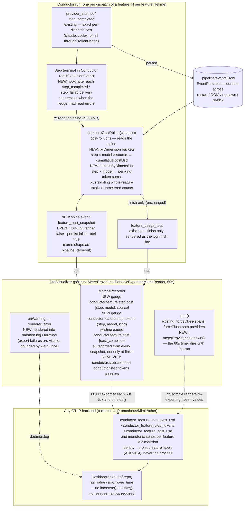
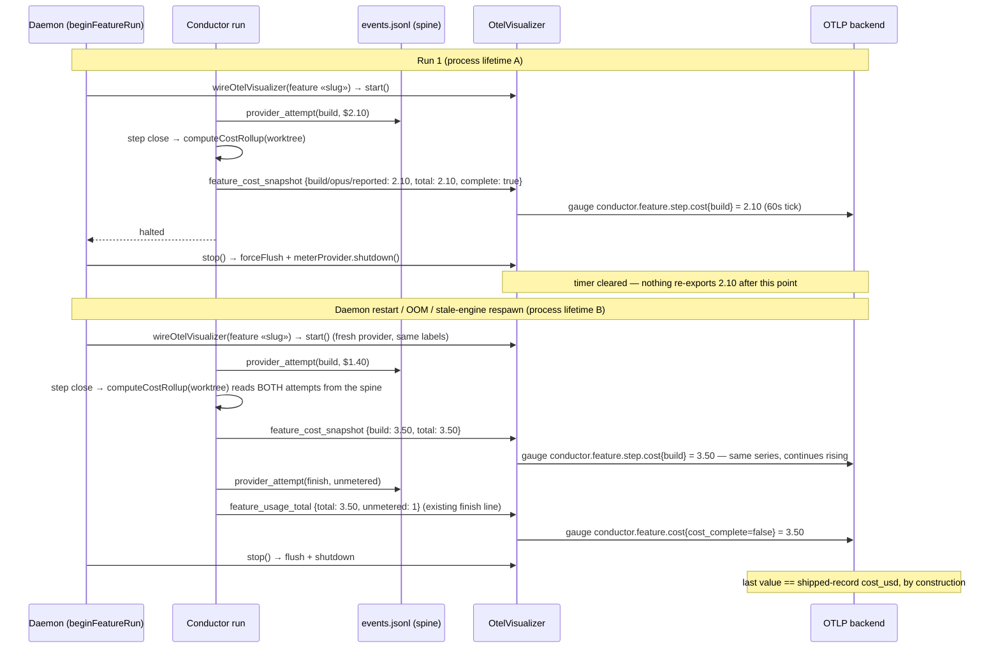

# Components: Spine-Derived Cumulative Cost Gauges (#2095, absorbs #2086)

**Last updated:** 2026-08-30
**Scope:** The cost path from a provider dispatch to a metric a dashboard can trust — the
event spine (`events.jsonl`), the cost rollup (`cost-rollup.ts`), the Conductor settle
loop (`conductor.ts`), the OTel visualizer lifecycle (`otel-visualizer.ts`) and its metrics
recorder (`metrics.ts`), the daemon's per-feature wiring (`daemon-cli.ts`
`beginFeatureRun`), and the out-of-repo LGTM dashboards that consume the exported series.
Trace/span structure is unchanged and out of scope (#2011).

## Diagram

## Sequence — a feature that halts, restarts, and re-runs

## Legend

- **NEW / REMOVED** — surfaces this feature adds or deletes; everything else exists today.
- Solid arrows: data flow. Dotted arrows: lifecycle/observability effects.
- The spine is the single source of truth: the finish line, the shipped record, and now every
  exported cost gauge are projections of the same `events.jsonl`, so they cannot disagree.
- Cumulative gauges need no backend reset handling: any OTLP backend stores the last value as-is.
  This is what makes the fix backend-agnostic (operator requirement) — delta temporality was
  rejected because its correctness would live in collector/Prometheus configuration.
- `conductor.step.cost` and `conductor.step.tokens` (the resettable per-process counters behind
  `conductor_step_cost_usd_total` / `conductor_step_tokens_total`) are removed — both share the
  splice defect; `conductor.step.dispatches` keeps its current semantics and is out of scope.

## Change Log

| Date | Change | Reason |
|------|--------|--------|
| 2026-08-30 | Initial generation | DECIDE for #2095 / #2086 |
| 2026-08-30 | Operator extension: token counts ride the same snapshot (`tokensByDimension` → `conductor.feature.step.tokens`); `conductor.step.tokens` counter removed | #2095 scope extension |
| 2026-08-30 | Plan update: emission hook pinned to the step-terminal path of `emitExecutionEvent`; snapshot suppressed on ledger read errors (`readErrors`) | /plan for #2095 |
