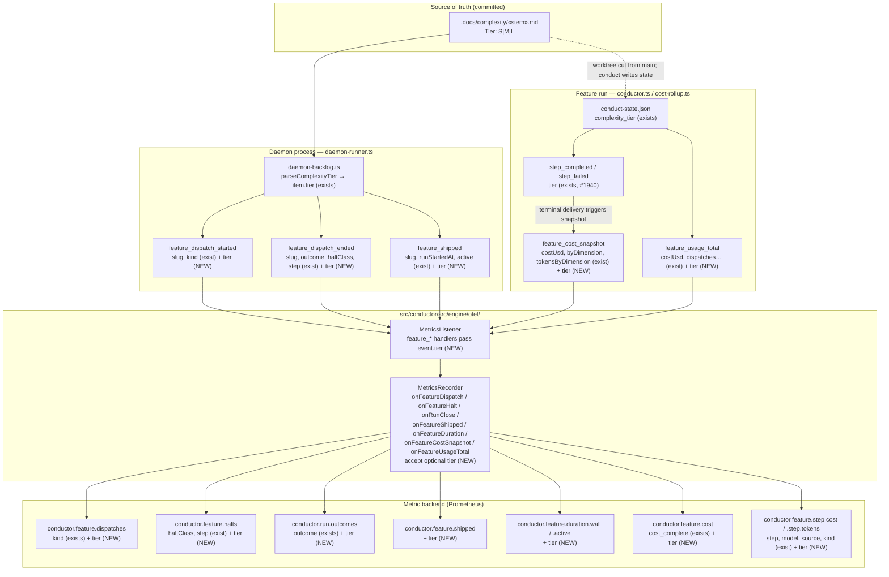
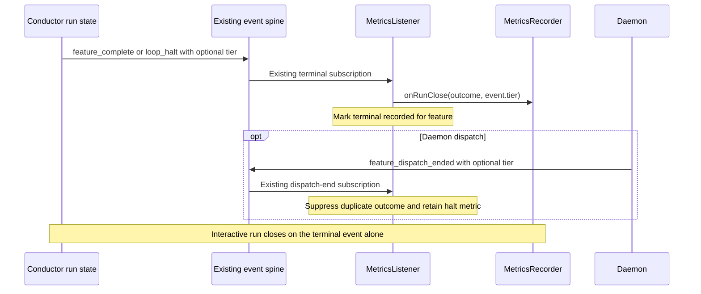

# Components: Feature-scoped OTel metrics carry the complexity tier (#2528)

**Last updated:** 2026-09-14
**Scope:** How the committed complexity tier (`.docs/complexity/«stem».md`) reaches the
feature-scoped metric data points exported through `src/conductor/src/engine/otel/`. Approach A:
an optional `tier` field on the five feature events that already describe the feature, threaded
through the single event-fed `MetricsListener` projection into `MetricsRecorder`'s feature
methods. No new instruments, no new event types, no new I/O.

> **Amended 2026-09-15 by #2528:** The original diagram below is supplemented by the terminal sequence below: seven existing events carry tier, including `feature_complete` and `loop_halt`. Dispatch-end is the outcome fallback; a preceding terminal event owns the normal outcome. This corrects the original scope and Legend claim.

## Diagram

## Resolution contract (one authoritative source per emit site)

| Event | Emit site | Tier source | Why this source |
|-------|-----------|-------------|-----------------|
| `feature_dispatch_started` | `daemon-runner.ts` (one site) | `item.tier` | Emitted before any state read on a fresh worktree; `BacklogItem.tier` is already parsed from the committed marker |
| `feature_dispatch_ended` | `daemon-runner.ts` (one site) | `item.tier` | Same dispatcher scope; avoids a second state read at close |
| `feature_shipped` | `daemon-runner.ts` (one site) | `item.tier` | The site already reads `conduct-state.json` for `run_started_at`, but `item.tier` is the same marker value with no parse dependency |
| `feature_cost_snapshot` | `conductor.ts` terminal delivery → `toFeatureCostSnapshot` (one site) | `tier` of the `step_completed`/`step_failed` that triggered it | That field was stamped from `state.complexity_tier` at the step's own emit (#1940 D11); reusing it adds no read and cannot disagree with the step series |
| `feature_usage_total` | `conductor.ts` `finish` close (one site) | `state.complexity_tier` | In-run scope; the same spread form already used at `conductor.ts:12321` |

Every source above descends from the one committed marker, so all seven instruments agree with the
step metrics for the same feature and dispatch. The raw `undefined` is carried through — never the
`?? 'L'` resolution `conductor.ts:6843` uses for skip policy — so an unresolved tier is **omitted**
from the attribute set, exactly as `effort`/`tier` are omitted on step points today.

## Label growth bound

`tier` is a closed 3-value set and varies within a worker process (unlike `otel.attributes`), so it
is a genuine multiplier: **×3 on seven instruments** (`feature.dispatches`, `feature.halts`,
`run.outcomes`, `feature.shipped`, `feature.duration.wall`, `feature.duration.active`,
`feature.cost`) plus the two per-dimension gauges (`feature.step.cost`, `feature.step.tokens`).
Because every one of these is already keyed by `feature`, and a feature has one tier per dispatch,
the *observed* series count is unchanged for a feature whose tier is resolved before its first
feature event — the label partitions existing series rather than minting new ones.

**Documented split:** the tier is stable within a dispatch (`.docs/` is sealed during BUILD, so the
marker cannot change mid-run). A feature re-tiered by a DECIDE amendment between dispatches emits
its later cumulative `feature.cost` samples under the new tier; the old-tier series stops updating
and keeps its last value. `sum by (tier)` of a last-value query therefore counts that feature once
per tier it has held — this is the honest record of a real re-tier, not a defect, and the runbook
query in `docs/reference/configuration.md` will say so.

## Legend

- **(NEW)** — added by this feature; every other node and field exists on main today.
- Solid arrows are the event/data path; the dashed arrow is the existing worktree-cut relationship
  by which the run's state derives its tier from the same committed marker.
- `feature_dispatch_ended` feeds both `feature.halts` (when halted) and `run.outcomes`
  (`onRunClose`), so `run.outcomes` is in scope by construction — excluding it would require an
  odd per-instrument exclusion in `MetricsRecorder`.
- Absent values are omitted from the attribute set, never filled with a placeholder, matching
  ADR-014 D10 and the #1940 review's C2.

## Change Log

| Date | Change | Reason |
|------|--------|--------|
| 2026-09-14 | Initial generation | DECIDE for #2528 (feature-scoped tier label; approach A) |
| 2026-09-14 | Plan-update pass: no structural change; plan Tasks 1–8 map onto the (NEW) nodes as drawn | /plan step 8b |

## Approved terminal sequence

> **Amended 2026-09-15 by #2528:** Terminal emitters use the current run state: `completeRun(state)` reads `state.complexity_tier`; `emitLoopHalt` reads `haltState.complexity_tier`. Undefined stays absent. The original five-event component paths remain, with this additional path for normal daemon and interactive outcomes.

If no terminal event preceded dispatch-end, its existing fallback records the outcome with its own tier. No state lookup or tier cache is added to the listener.
