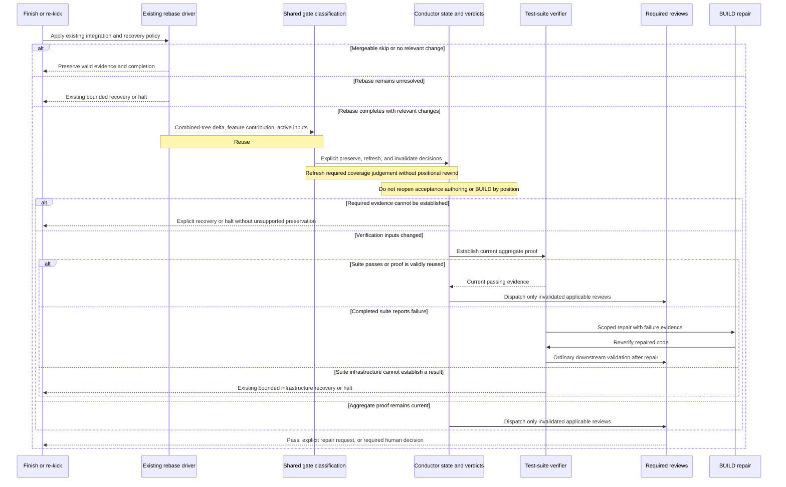

# Sequence: Selective verification after a completed rebase

**Last updated:** 2026-09-11
**Scope:** Proposed post-rebase flow for #2253, implementing operator-approved approach A. Existing finish/re-kick entry policy and pre-rebase recovery retain their owners. This diagram awaits operator validation.

> **Amended 2026-09-11 by #2253:** The operator approved this flow in the composer session. The comparison and selective-state architecture were subsequently approved and are recorded in adr-2026-09-11-selective-post-rebase-verification.

## Diagram

## Legend and behavior boundaries

- **Existing entry policy:** preserve #1207/#2515 normal-finish versus mandatory re-kick distinctions, current code/test safeguards, protected-artifact checks, evidence translation, and #2495 pre-rebase collision recovery. The diagram starts new behavior only after an actual successful rebase.
- **Shared gate classification:** extend #2453's single projection rather than create another document resolver or event-classification path. A changed active review document remains invalidating even when the feature's implementation contribution is unchanged.
- **Feature contribution:** the implementation change relative to its base before versus after replay, not the set of overlapping file names. The precise comparison and conservative fallback are architecture-review decisions still to be resolved.

> **Amended 2026-09-11 by #2253:** The approved ADR resolves this comparison as a clean explicit-base expected merge tree equal to H, bound to immutable P/B/O/H; unavailable comparison is conservative. Plan Tasks 1–3 implement it. Tasks 6–10 bind and reconcile existing gate evidence; Tasks 11–19 wire the shown continuation and recovery paths.

- **Coverage refresh:** coverage binding remains a judgement, not a newly invented tree-attesting predicate. Refresh only when its actual inputs require it; a real coverage/specification failure blocks and routes explicitly. This refresh must not cause acceptance-spec generation or a completed BUILD task walk by adjacency.
- **Explicit state changes:** rebase-origin handling reopens only the invalidated checks and required publication continuation. Ordinary repair still invalidates its dependent evidence. Never convert a pending failure, missing evidence, or unrelated repair obligation into PASS.
- **Suite reuse:** the native verifier remains authority for fingerprints and explicitly configured drift tolerance. Reopening verification does not force execution when that authority proves existing evidence reusable.
- **Review failure:** implementation defects enter existing bounded repair; scope/decision gaps and unavailable evidence retain their established routes. This feature does not redesign review-remediation ownership.
- **Observability:** existing gate-preserved, gate-invalidated, reverified, kickback, and halt events use the current event spine. No parallel log or channel is proposed.
- **Dependencies:** #2211 / PR #2453 must supply its delivered classification seams before this implementation is dispatched. Sequence integration with #415 / PR #2495 on shared rebase-driver files. #2462 and #2488 remain separate issue owners; rely on valid existing evidence and report any unmet prerequisite rather than duplicating their repairs.

## Change Log

| Date | Change | Reason |
|---|---|---|
| 2026-09-11 | Initial proposed flow | Whole-flow scope and in-flight ownership confirmed by operator |
