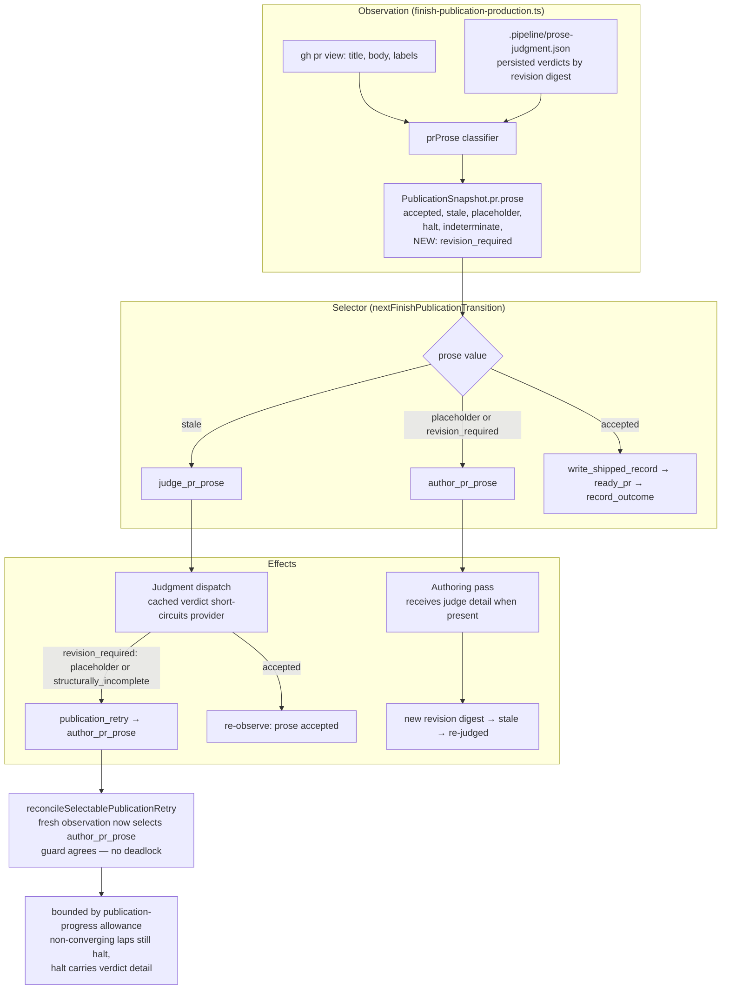

# Components: FINISH prose revision lap (issue #2006)

**Last updated:** 2026-08-28
**Scope:** the FINISH publication prose subsystem — how a judged-deficient PR body routes back
to authoring instead of deadlocking on `publication_transition_unmoved`.

## Diagram

## Legend

- **NEW: revision_required** — the added prose state. Derived at observation time: an authored
  body whose exact revision digest has a persisted `revision_required` verdict (reason
  `placeholder` or `structurally_incomplete`) in `.pipeline/prose-judgment.json`.
- `revision_required` with reason `halt` keeps its current terminal routing
  (`judgment_halt_prose`, human required) — it never enters the authoring lap.
- The reconcile guard (`reconcileSelectablePublicationRetry`) is unchanged: it stops
  deadlocking because the fresh observation's selector now agrees with the retry's transition.
- Bounding is the existing publication-progress allowance; no new counters.

## Change Log

| Date | Change | Reason |
|------|--------|--------|
| 2026-08-28 | Initial generation | DECIDE for issue #2006 (spec authoring) |
