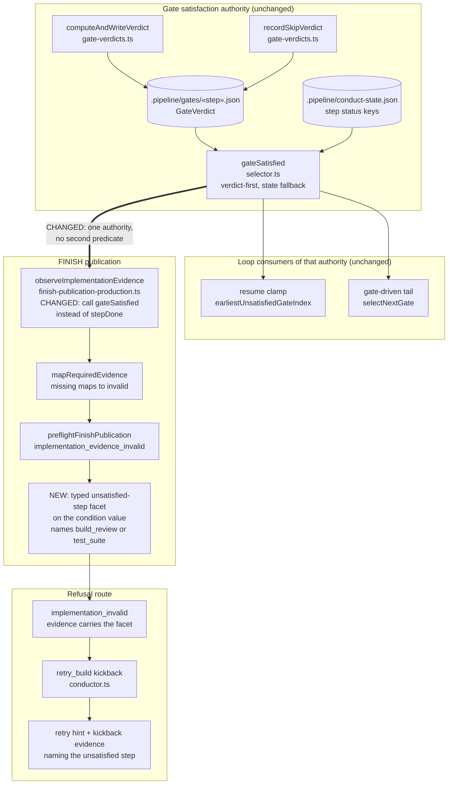

# Components: FINISH Implementation-Evidence Observation and Its Diagnostic (#1587)

**Last updated:** 2026-09-14
**Scope:** The single seam where FINISH decides whether implementation evidence is valid —
`finish-publication-production.ts` `observeImplementationEvidence` — and the typed path its
refusal takes to the operator: `mapRequiredEvidence` and `preflightFinishPublication`
(`finish-publication.ts`), the `implementation_invalid` route, and the `retry_build` kickback
evidence in `conductor.ts`. Excludes the gate-resolution write-through and the `finish`
cumulative bound; both are ADR-refused and recorded in the track marker.

## Diagram

## Legend

- **CHANGED** marks the one redirected edge: `observeImplementationEvidence` stops reading step
  state directly and consults `gateSatisfied`, the same function the resume clamp and the tail
  already call. **NEW** marks the typed facet added to the existing condition value.
- The `Authority` and `Loop` subgraphs are entirely unchanged. No new write edge reaches
  `conduct-state.json`, and no new durable file, counter, or config key is introduced.
- The double edge `GS ==> OBS` is the whole fix: today FINISH reaches `STATE` directly, bypassing
  the verdict layer, which is how the loop and FINISH come to disagree about a gate the loop has
  already resolved.

## Component Notes

- **One authority, no new predicate.** `adr-2026-07-11-verdict-aware-resume-entry` D5 requires
  that no second satisfaction predicate be introduced and that consumers call the same
  `gateSatisfied` the selector uses. This change brings the last state-only consumer into that
  rule rather than adding anything.
- **No state is written.** The rejected alternative — persisting a status when a gate resolves
  without dispatch — is `adr-2026-07-11`'s Option C, refused again by
  `adr-2026-08-19-tree-attesting-gates-recheck-before-dispatch` D3 ("the re-check reads; it never
  writes"). The durable record of a resolution already exists as the gate verdict; this change
  reads it rather than copying it.
- **The facet is a value, not a message.** `adr-2026-09-05` D5 and `adr-2026-08-18` D1 forbid any
  consumer matching on reason text, so the unsatisfied step travels as a typed field on the
  condition and the `implementation_invalid` evidence.
  `adr-2026-07-11-finish-step-engine-completion-machinery` D4 already established a
  machine-readable facet code beside `reason` on the finish predicate result; this extends that
  seam.
- **Failure direction is unchanged.** A gate with an unsatisfied verdict, or with no verdict and
  no state key, still reads unsatisfied and still blocks FINISH. The change removes only the case
  where a gate the loop resolved reads as missing to FINISH.

## Change Log

| Date | Change | Reason |
|------|--------|--------|
| 2026-09-14 | Initial generation | Authored during DECIDE for #1587 |
| 2026-09-14 | Rescoped to the FINISH observation seam | 170-feature telemetry validation showed the deadlock unevidenced; the write-through and cumulative bound were ADR-refused and dropped |
