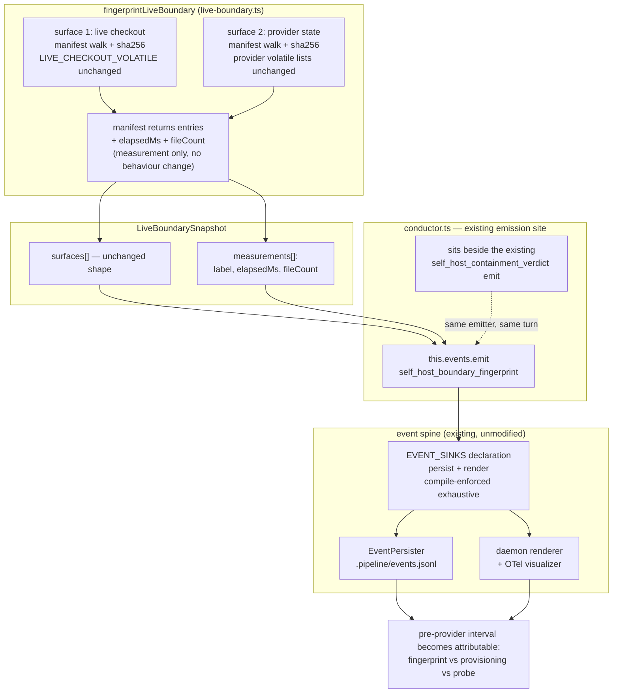
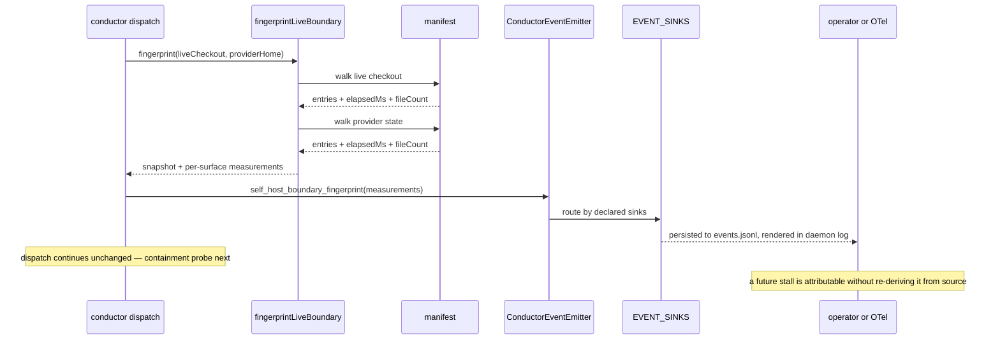
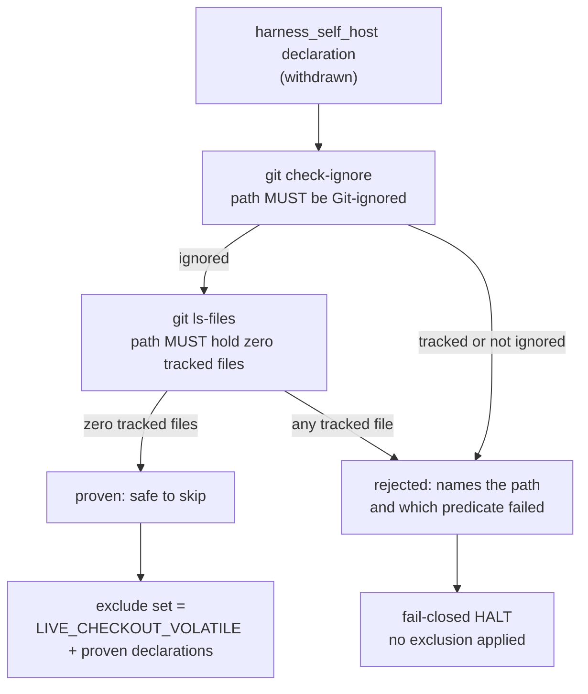

# Components + Sequence: attributable live-boundary fingerprint cost (#1219)

**Last updated:** 2026-09-21
**Scope:** how the wall-clock cost of the self-host live-boundary fingerprint becomes attributable.
`fingerprintLiveBoundary` measures each surface's walk as it builds it and returns those
measurements as data on the snapshot; `conductor.ts` emits one additive `ConductorEvent` carrying
them, so the pre-provider interval can be split between fingerprinting and everything else. No
exclusion behaviour changes.

> **Amended 2026-09-21 by #1219:** this artifact originally specified a project-declarable
> exclusion mechanism (a `harness_self_host` config key proved at use time against `git
> check-ignore` and `git ls-files`). That design is **withdrawn from this feature** and preserved
> below under "Superseded design". The pre-stories architecture review returned BLOCKED: it
> contradicts APPROVED `adr-2026-08-17-structural-live-checkout-containment` D4 ("no exclusion is
> added"), and its latency premise is falsified by measurement — the generated tree costs ~20 ms
> of a 410 ms walk, and both bulk-cost candidates (`node_modules`, the provider home's
> `projects/`) were already excluded before the 2026-07-31 incident. The operator selected
> resolution R-1: ship the diagnostic now, and let the emitted duration decide whether the
> exclusion question is worth re-opening. See
> `.docs/decisions/architecture-review-2026-09-21-generated-project-artifacts-delay-provider-startup.md`.

## Diagram

## Legend

- **Measurement, not behaviour.** `manifest()` gains an elapsed-time and file-count return; the
  walk, the exclusion sets, the hashing, and the diff are untouched. A run with the event ignored
  behaves byte-for-byte as today.
- **`live-boundary.ts` never touches the bus.** It returns measurements as data and `conductor.ts`
  emits, mirroring how `verifyLiveBoundary` returns a verdict that `conductor.ts` turns into
  `self_host_containment_verdict` today. This keeps the safety module free of emitter plumbing and
  keeps one emission site.
- **Per-surface, not one total.** The event carries a measurement per surface rather than a single
  number. A single total cannot distinguish the live checkout from the provider home, which is
  exactly the distinction the 2026-07-31 misdiagnosis turned on — so per-surface is read here as
  *the duration signal*, not as the "per-surface breakdown" the operator's original scope boundary
  excluded. Slowest-path enumeration remains out of scope.
- **Additive union member.** `EVENT_SINKS` is typed over `ConductorEvent['type']`
  (`engine/event-sinks.ts:12`, `adr-2026-07-26-event-sink-registry-exhaustiveness`), so the new
  variant fails compilation until it declares its sinks. Render-path obligations follow
  `adr-2026-07-10-intra-step-build-progress-events`.
- **No config surface.** Nothing is declarable by a project in this feature, so no key, no
  validator branch, and no engine-before-config deployment ordering.

## Superseded design (preserved — withdrawn 2026-09-21, see amendment above)

The withdrawn mechanism: a project declares checkout-local generated or cache paths via a new key
on `harness_self_host`; the engine proves each declared path at every fingerprint (the path must be
Git-ignored **and** contain zero tracked files, via `git check-ignore` and `git ls-files`), with
both predicates required and any git indeterminacy a fail-closed halt naming the path; the proven
set is stored on `Surface.exclude` so `verifyLiveBoundary` re-walks symmetrically, with a re-proof
at verify as an extra guard rather than an input to the manifest diff; scope limited to the live
checkout surface, leaving the provider-state leak detector's engine-owned lists untouched.

## Change Log

| Date | Change | Reason |
|------|--------|--------|
| 2026-09-21 | Initial generation | DECIDE for #1219 — generated project artifacts delay provider startup |
| 2026-09-21 | Declaration mechanism withdrawn; diagram narrowed to the fingerprint-duration signal | Architecture review BLOCKED (APPROVED-ADR conflict + falsified latency premise); operator selected resolution R-1 |
