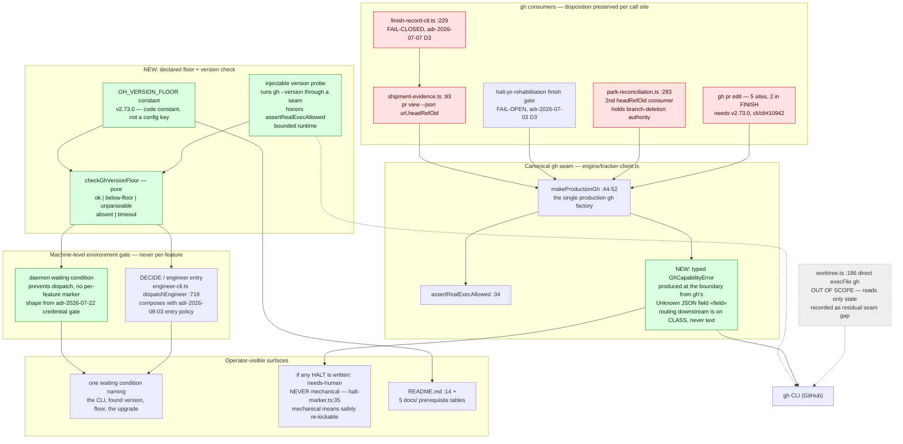

# Components: `gh` version floor and daemon-level environment gate

**Last updated:** 2026-09-05
**Scope:** Target-state component view for jstoup111/ai-conductor#2139 — where the declared `gh`
version floor lives, how a machine below it prevents dispatch without ever being charged to a
feature, and where an unsupported-`--json`-field error becomes a typed capability error. Paths are
relative to `src/conductor/src/`. All line anchors are at `main` `e54f1ba4e`.

Prior art this design lives inside: `canonical-tracker-client-seam-with-per-backend-tra.md` (the
seam it extends) and `finish-publication-burns-its-retry-budget-on-an-un.md` (the retry loop whose
budget the defect burns).

## Diagram

## Legend

- **Green** — added by this feature.
- **Red** — existing consumers that break below the floor.
- **Grey, dashed** — the one direct-`gh` call outside the seam, explicitly out of scope.
- **Dotted edges** — process invocations that bypass the seam's JSON-field surface.
- Guillemets `«…»` mark variable label text.

## Design notes

**An old `gh` is an infrastructure failure, so it is never charged to a feature.** The defect
today is not only that the message is wrong — it is that a machine-wide environment problem is
recorded against one feature's PR, burns that feature's retry budget, and re-dispatches forever.
The gate therefore lives at the machine level: one waiting condition that *prevents* dispatch,
following `adr-2026-07-22-daemon-level-missing-credential-gate`, which writes no per-feature HALT
markers. This is the same shape the 2026-09-05 #2190 review restates as "shared-cause provider
unavailability is a daemon-level pause, not a per-feature marker."

**Infrastructure does not mean re-kickable.** `halt-marker.ts:35` defines the `mechanical` halt
class as marks "the daemon may safely re-kick." A below-floor `gh` is mechanical in origin but not
transient — a re-kick meets the identical CLI. Any HALT this path writes is `needs-human`.

**The floor is a code constant, not a config key.** Following
`adr-2026-08-06-bounded-progress-allowance-for-finish-publication` — "constants rather than
`settings.json` keys… a correctness backstop, not a tuning knob." A version floor an operator can
lower in the field is a floor that does not hold. This also avoids the consumer-registry
obligation (`adr-2026-08-26` D4) and the mandatory `## Migration` block a schema change would
carry.

**The probe is injectable and honors the exec kill switch.** `AI_CONDUCTOR_NO_REAL_EXEC` is set
globally by the test setup, and both `runDaemonMode` and `dispatchEngineer` boot in tests. A raw
`execFile('gh', ['--version'])` at either entry point would make every such test shell out, so the
probe takes an injectable runner and calls `assertRealExecAllowed` like every other production
factory.

**Translation wraps the runner factory; disposition stays per call site.** Per #774 the PR-side
`gh` paths stay outside the `TrackerClient` interface, but all of them obtain their runner from
`makeProductionGh()`, so wrapping the factory reaches `shipment-evidence.ts` — the site that
actually fails — while wrapping the interface would not. Critically, the wrapper changes only the
*type and text* of the error, never a caller's disposition: `finish-record-cli.ts` stays
fail-closed (`adr-2026-07-07` D3) and the finish completion gate stays fail-open
(`adr-2026-07-03` D3). Downstream routing keys on the error class, never on gh's message text
(`adr-2026-08-18` D1).

**Two `headRefOid` consumers, not one.** The intake names `shipment-evidence.ts:93`.
`park-reconciliation.ts:283` is the second, and `adr-2026-08-01-multi-proof-park-deletion-authority`
D1 makes merged-PR `headRefOid` identity one of two equal-strength branch- and worktree-deletion
authorities. Below the floor it degrades to inaction with a misleading refusal cause.

## Change Log

| Date | Change | Reason |
|------|--------|--------|
| 2026-09-05 | Initial generation | DECIDE for jstoup111/ai-conductor#2139 |
| 2026-09-05 | Reshaped to a machine-level gate; floor pinned to v2.73.0; probe made injectable | Repo-wide ADR sweep + operator's infrastructure-failure framing |
| 2026-09-05 | Added the `timeout` verdict and the probe's bounded runtime | Plan-update mode: a hung `gh --version` must not wedge a dispatch cycle |
