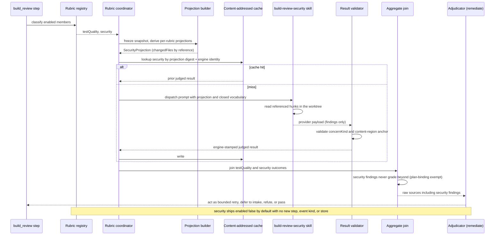

# Sequence: Security rubric branch inside the build_review container

**Last updated:** 2026-09-14
**Scope:** One `build_review` lap with the built-in `security` rubric enabled. Shows how the new member joins the existing engine-managed fan-out, its own closed projection and vocabulary, and the plan-binding exemption that routes every security finding into the existing adjudicator instead of the `beyond` bucket. Nothing outside the container changes.

## Diagram

## Legend

- **Rubric registry** — the closed built-in catalog. `security` is a second entry beside `testQuality` with its own `skillName`, `projectionVersion`, and content-addressed cache policy.
- **SecurityProjection** — a new projection member carrying only the common fields (lap, digests, `mergeBase`, `headSha`, `changedFiles` by reference). No test-scope, preflight, or counterfactual fields.
- **Closed vocabulary** — one `concernKind` per graded class — ten in all: the five named in #2034 plus the diff-gradable OWASP Top 10 categories (A04, A06, A09 excluded); the CI vocabulary guard binds the skill text to the engine set in both directions.
- **Content-region anchor** — `{path, contentHash, display}` where `contentHash` is `sha256` of the normalized hunk content. Line numbers are forbidden by the reference-schema ADR.
- **Plan-binding exempt** — the one behavioural difference from `testQuality`: a security finding is never `beyond`, so it always reaches the adjudicator, which may issue a bounded BUILD retry work order under the existing kickback cap, defer to intake, or refute. No plan task is ever appended.
- **Cache** — identity includes the rubric id, projection digest, policy fingerprint, and the `skills/build-review-security/SKILL.md` digest; a skill edit re-judges.

## Change Log

| Date | Change | Reason |
|---|---|---|
| 2026-09-14 | Initial sequence for the security rubric branch. | Design the second built-in member of the opt-in rubric container (#2034). |
