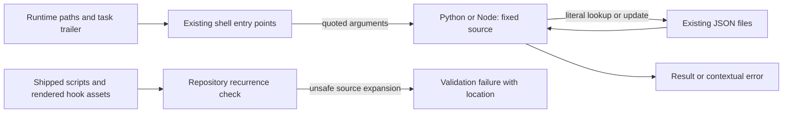

# Components: Runtime values remain literal data

**Last updated:** 2026-09-06
**Scope:** Proposed argument flow for #1478 within existing shell/interpreter components. Existing system containers and state ownership remain unchanged.

## Diagram

## Legend

The upper flow covers bin/install configuration helpers, the generated commit-msg hook, and the session-start summary. Values are carried in arguments, never inserted into interpreter source. Existing stdin payload parsing in other hooks remains valid. The lower flow is development-time validation, not a new runtime service or telemetry channel.

## Boundary constraints

- Preserve current interpreter choices, file formats, hook exemptions, and task lookup semantics.
- Quotes, backslashes, whitespace, and interpreter-looking text remain data within each caller's existing input grammar. A Git trailer is not redefined as an arbitrary multiline field.
- Interpreter failures remain distinguishable from a successful negative lookup. An advisory session summary can report an error while preserving its non-blocking hook policy.
- The recurrence check inspects shipped shell and rendered hook content, including expanded heredocs and command-string expansion; static source with separately passed arguments or stdin is permitted.
- No new persistence, daemon coordination, network call, or event channel is introduced.

## Change Log

| Date | Change | Reason |
|------|--------|--------|
| 2026-09-06 | Added scoped component flow | Approved technical approach for #1478 |
