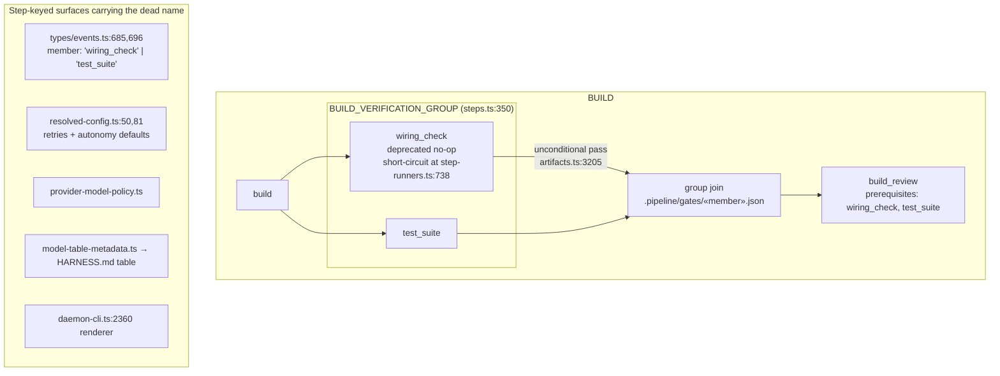
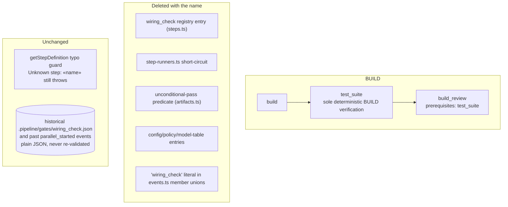

# Components: Hard-delete the retired wiring_check step name

**Last updated:** 2026-08-26
**Scope:** The second phase owed by `adr-2026-08-11-deprecated-no-op-step-retirement`: removing the
`wiring_check` name from the step registry, the BUILD verification fan-out, the event unions, and
every step-keyed surface. No new machinery — this diagram shows the fan-out shape before and after.

## Diagram — current state

## Diagram — after this change

Whether `BUILD_VERIFICATION_GROUP` survives as a one-member group or is dissolved into a direct
`build → test_suite → build_review` edge is decided in architecture review; the rendered fan-out is
identical either way.

## Legend

- Solid arrows: dispatch/prerequisite order.
- «name» — placeholder for a variable step name.
- "Removed" nodes are deletions, not new components.

## Change Log

| Date | Change | Reason |
|------|--------|--------|
| 2026-08-26 | Initial generation | DECIDE for #1896 (hard deletion phase of the wiring_check retirement) |
