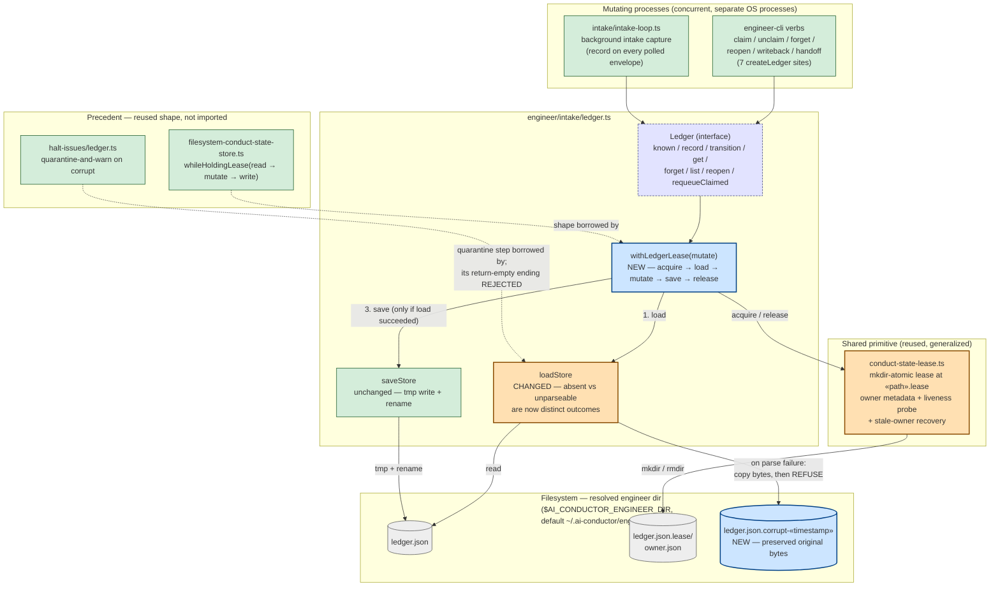

# Components (L3): Intake Ledger Durability Hardening

**Last updated:** 2026-08-25
**Scope:** `src/conductor/src/engine/engineer/intake/ledger.ts` and its mutating callers,
after the corrupt-read fail-closed + lease-guarded read-modify-write change (intake #1476).
Extends [components-engineer-intake.md](components-engineer-intake.md), which shows the
ledger as a single opaque node.

## Diagram

## Legend

- **Blue (new):** the lease wrapper `withLedgerLease`, and the quarantine copy
  `ledger.json.corrupt-«timestamp»` that preserves the original bytes.
- **Orange (changed):** `loadStore`, which today collapses *absent* and *unparseable* into
  one empty-store outcome and after this change must separate them; and
  `conduct-state-lease.ts`, which is generalized from its single conduct-state consumer so
  its diagnostics are not misleading when it guards the intake ledger.
- **Green (existing, unchanged):** the CLI verbs, the intake loop, `saveStore`'s atomic
  tmp+rename, and the two in-repo precedents.
- **Dashed lilac (interface):** the public `Ledger` seam — its method signatures are
  unchanged by this work; only their failure behavior changes.
- **Dotted edges into the precedent box** are *design provenance*, not runtime calls.
  Nothing in `intake/ledger.ts` imports `filesystem-conduct-state-store.ts` or
  `halt-issues/ledger.ts`.

## Key invariants encoded

1. **`saveStore` is unreachable when `loadStore` did not succeed.** The `3. save` edge is
   conditional on step 1. This is the structural expression of "a corrupt ledger is never
   overwritten by the next mutation".
2. **Every mutating path passes through `withLedgerLease`.** There is no edge from `API`
   to `LOAD` or `SAVE` that bypasses `GUARD`, so no caller can perform an unguarded
   read-modify-write — including the read-only `known` / `get` / `list` verbs, which must
   still not observe a torn intermediate state.
3. **The lease lives beside the ledger, not in `.daemon/`.** `ledger.json.lease/` is created in
   whatever directory `resolveEngineerDir` returns — `$AI_CONDUCTOR_ENGINEER_DIR`, defaulting to
   `~/.ai-conductor/engineer/` (`engineer-store.ts:185-193`). Note that this is a **user-global
   path outside every repository**, despite the `.engineer/` shorthand used in ADR-011 and
   `components-engineer-intake.md`: the ledger is one cross-repo singleton shared by every
   project's engineer verbs and background intake loop, which is precisely why invariant 2's no-bypass rule
   matters. The daemon's `.daemon/` state is untouched either way.
4. **The quarantine artifact is a copy, not a rename.** Unlike `halt-issues/ledger.ts`,
   the original `ledger.json` stays in place so that the refusal is repeatable and the
   operator's recovery is not racing a second process that would then see an absent file
   and start empty.

## Change Log

| Date | Change | Reason |
|------|--------|--------|
| 2026-08-25 | Removed the dormant `runEngineerMode` writer from the component graph | #1638 deleted the dead launch path; `intake-loop.ts` is the live background writer |
| 2026-08-12 | Initial generation | Intake #1476 — corrupt-read wipe + unguarded concurrent read-modify-write |
