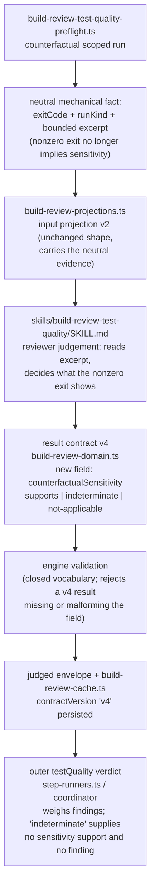
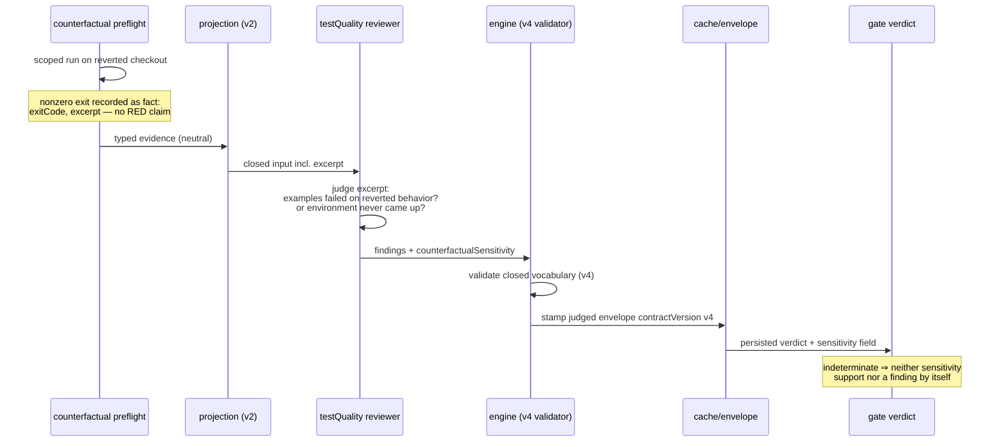

# Components + Sequence: neutral counterfactual exit facts, reviewer-owned sensitivity (#2051)

**Last updated:** 2026-08-30
**Scope:** the testQuality counterfactual evidence path — how the preflight stops asserting
sensitivity from a bare nonzero exit, and how the sensitivity judgement becomes a
schema-constrained field of the reviewer's result contract (v3 → v4) that the engine
validates and persists.

## Diagram

## Legend

- **neutral mechanical fact** — the preflight keeps recording exactly what is true on every
  test runner: exit code, run kind, bounded head/tail excerpt. The `exitCode !== 0 ⇒ red`
  fiat at `build-review-test-quality-preflight.ts:455` is retired; the classification value
  becomes descriptive (`nonzero-exit`) rather than evidentiary.
- **counterfactualSensitivity** — the reviewer's schema-constrained judgement of what the
  nonzero exit shows: `supports` (assertions/examples failed because reverted production
  matters — preserves #1593's collection-failure case), `indeterminate` (bootstrap, auth,
  or infrastructure died before intended tests ran — the #1915 shapes), `not-applicable`
  (exit zero / no counterfactual). No per-framework output parsing exists anywhere in the
  engine — the judgement call sits with the LLM, the bookkeeping with machinery.
- **fail-closed validation** — a v4 result missing the field, or using a value outside the
  closed vocabulary, is rejected exactly like any other malformed rubric result today.
- **verdict weighing** — `indeterminate` can never supply positive sensitivity evidence nor
  become a finding; the reviewer must still cite a concrete stub-passable assertion to raise
  `test-insensitive`, unchanged from v3.

## Change Log

| Date | Change | Reason |
|------|--------|--------|
| 2026-08-30 | Initial generation | DECIDE for #2051 (approach D) |
