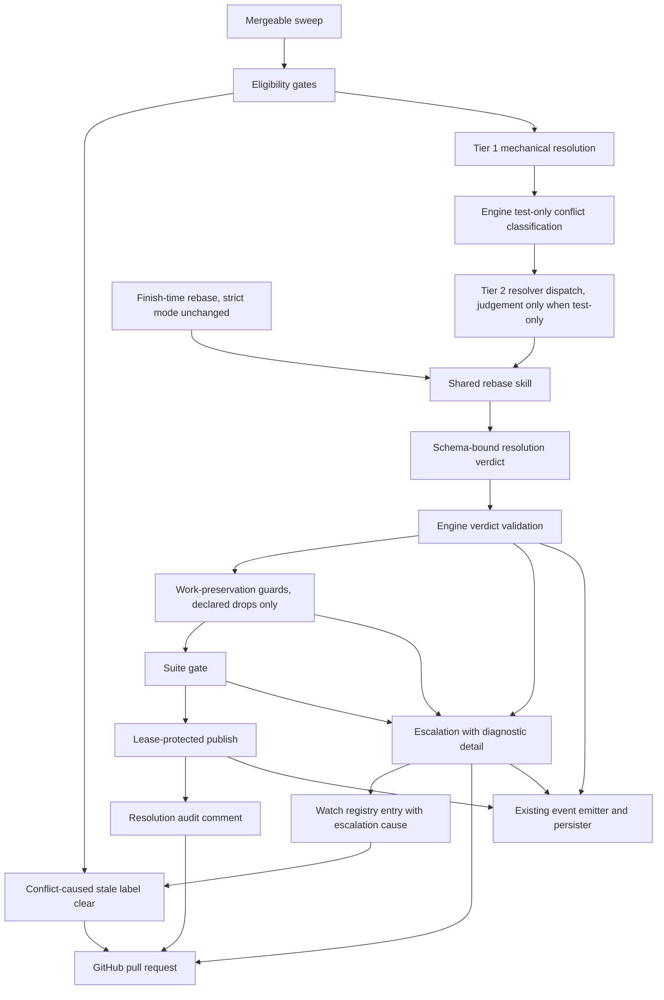
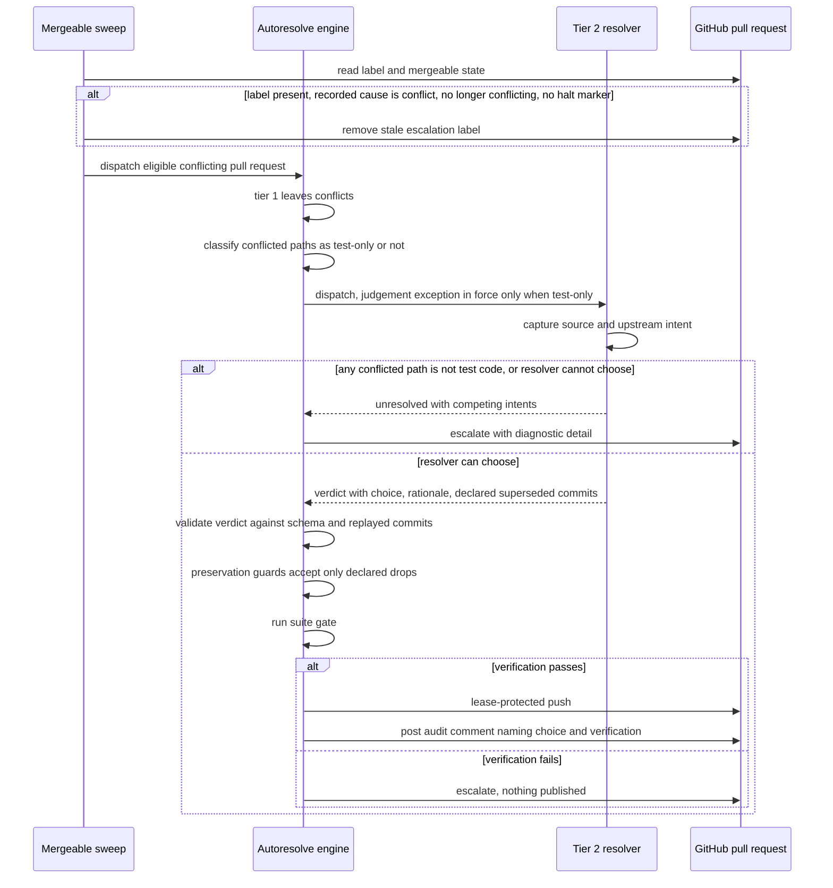

# Components: Sweep tier-2 conflict judgement under engine verification

**Last updated:** 2026-09-20
**Scope:** Proposed change to the mergeable sweep's autoresolve path for #2607. Extends the existing daemon process; no new deployment, data store, or telemetry channel. The finish-time rebase path is shown only to mark it as unchanged.

## Diagram

## Sequence: a supersession conflict resolved without the operator

## Responsibilities and limits

The resolver owns the judgement the machinery cannot make: which side's intent survives when both changed the same lines, including declaring a replayed commit superseded by upstream. It makes that judgement only when dispatched by the sweep and only when the engine has established that every conflicted path is test code; a conflict touching any non-test path keeps today's stop. The finish-time rebase invokes the same skill in today's strict mode and still halts at the first ambiguity.

The engine owns everything checkable. It validates the verdict's shape, classifies the conflict as test-only using the existing test-path convention, confirms every declared-superseded commit is one the rebase actually replayed and touched only test paths, lets the work-preservation guard excuse exactly those commits and no others, runs the suite gate, and publishes only after it passes. An undeclared missing commit fails the guard as it does today. The audit comment names the choice, the rationale, and the verification that passed, so a publication without a named passing verification cannot occur.

The sweep owns label hygiene for the escalations it caused. Autoresolve records the escalation cause on the existing watch registry entry. A `needs-remediation` label whose recorded cause is conflict resolution, on a pull request that is no longer conflicting and carries no halt marker, is stale, and the sweep removes it before evaluating eligibility; labels written for CI exhaustion, setup stops, or halted builds are never touched, so an operator or a later main that clears the conflict restores eligibility without a manual label edit.

Escalation keeps today's diagnostic detail. It fires when any conflicted path is not test code and the resolver cannot settle it under the strict contract, when the verdict is malformed, when a guard rejects the result, or when the suite fails.

## Legend

- "Sweep judgement mode" and "strict mode" are two invocations of one shared skill, selected by the dispatching path.
- "Declared drops" are replayed commits the verdict names as superseded by upstream.
- All observation rides the existing `ConductorEvent` spine; no sidecar file or second channel is introduced.

## Change Log

| Date | Change | Reason |
|------|--------|--------|
| 2026-09-20 | Initial generation | DECIDE for #2607 |
| 2026-09-20 | Narrowed judgement to test-only conflicts; label clear keyed on recorded cause | Architecture review ADR sweep, operator decision |
