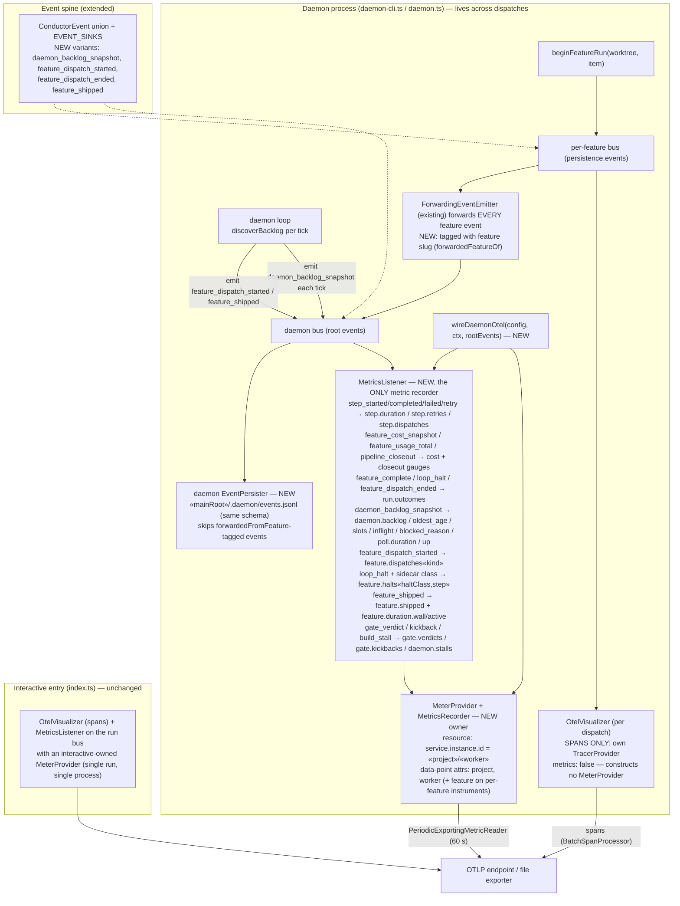

# Components: Daemon-owned meter and daemon-level metrics

**Last updated:** 2026-09-08
**Scope:** Where metrics are recorded after #1937 — one long-lived `MeterProvider` and
`MetricsRecorder` owned by the daemon process, shared by every per-dispatch OTel visualizer
(which keeps owning spans), plus the daemon-scoped listener that turns backlog snapshots,
dispatch starts, halts, ships, and gate verdicts into daemon-level and per-feature instruments.
Interactive `conduct` runs (no daemon) are unchanged.

## Diagram

## Legend

- **NEW owner** — the daemon constructs the one `MeterProvider`; it lives for the daemon's life, so
  every counter recorded on it is monotonic across re-dispatches. This is what fixes
  `conductor.run.outcomes` (stuck at 1.0) and `conductor.step.retries` (resets per dispatch).
- **Event-fed** — the `MetricsListener` derives every instrument from typed events on the bus it is
  attached to. Nothing about recording depends on which process ran the step, so a future remote
  worker only has to ship its event stream to the dispatcher; no metric code changes.
- **Per-dispatch visualizer** — still one per feature dispatch on the feature bus, still owns the
  `TracerProvider` (spans are per-run by nature, `conductor.run.id` stays on the trace resource).
  Under the daemon it is spans-only and builds no meter.
- **Forwarding** — every per-feature event is already re-emitted onto the daemon bus by the
  existing forwarding emitter; the copy is now tagged with its feature slug. Forwarded events are
  not re-persisted; the per-feature `events.jsonl` remains their ledger.
- **Metric identity** — `service.instance.id = «project»/«worker»`; trace identity remains unchanged. `worker` defaults to hostname and is
  overridable by `otel.worker_name`. Backlog gauges report the same value from every worker of a
  project (query with `max by (project)`); slots are per-worker (`sum`), while
  `daemon.inflight` is the one feature-scoped daemon instrument and carries `feature`.
- **Backlog age** — durable per-slug state-entry records retain their timestamp while state is
  unchanged and replace it when the feature moves state; age never means first-ever discovery age.
- **Interactive path** — no daemon; the visualizer (spans) and a `MetricsListener` with an
  interactive-owned meter attach to the run bus, so the recording code path is the same one and
  the exported instrument set is byte-identical to today.
- Disabled/absent OTel config → `wireDaemonOtel` returns null and `beginFeatureRun` passes no
  recorder; daemon behavior unchanged.

## Change Log

| Date | Change | Reason |
|------|--------|--------|
| 2026-09-06 | Initial generation | DECIDE for #1937 (daemon-level metrics) |
| 2026-09-06 | Added daemon EventPersister node | Plan update (architecture-review condition C6) |
| 2026-09-06 | Listener records every metric; visualizer spans-only | Operator-directed revision for remote/ephemeral workers |
| 2026-09-08 | Preserve trace identity; classify inflight as feature-scoped; measure state residence | Operator resolution of as-built AB-6, AB-7, AB-10 |
