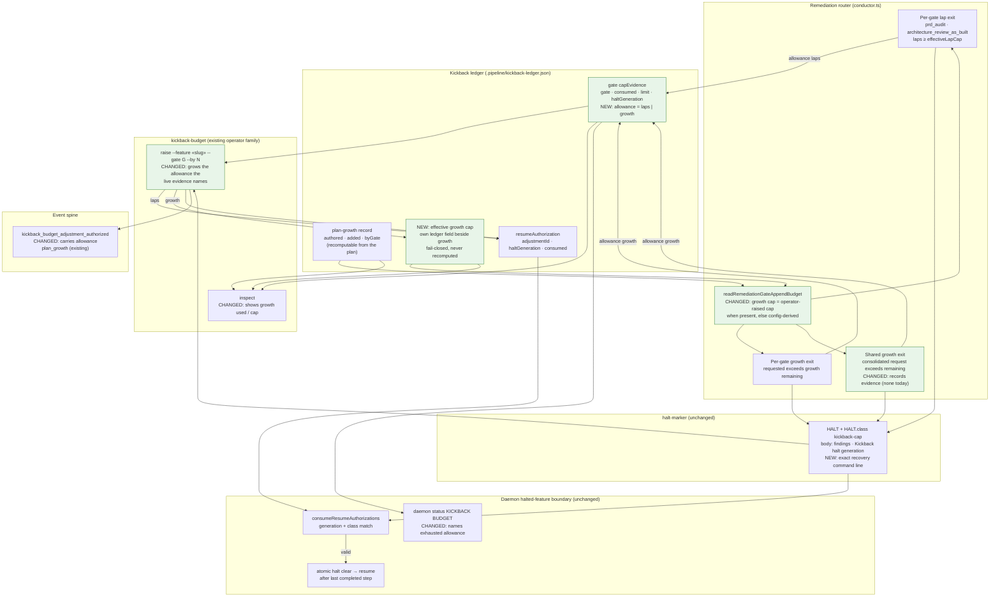
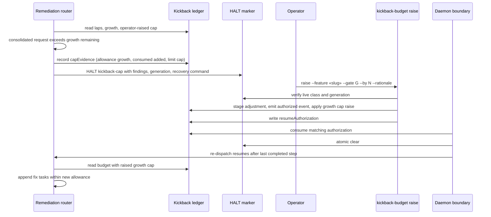

# Components: every remediation budget halt is recoverable by one kickback-budget raise (#2185)

**Last updated:** 2026-09-24
**Scope:** The continue-only slice of #2185. The three remediation budget exits in the
remediation router (per-gate lap cap, per-gate plan-growth cap, shared plan-growth allowance),
the kickback ledger's typed cap evidence and plan-growth record, the existing
`kickback-budget` operator command family, and the daemon's existing authorization → clear →
resume boundary. Nothing here adds a halt class, marker, grant store, or unattended grant.

## Diagram

## Sequence: operator continues a feature halted on the shared growth allowance

## Legend

- Green — changed by this feature. Everything else is existing machinery reused as-is.
- «…» — variable segment placeholder.
- The CLI never clears a halt (adr-2026-08-29 successor D4); it records an authorization the
  daemon consumes at its existing boundary.
- The exhausted allowance is read from typed evidence written at the exit, never parsed from
  halt prose (adr-2026-08-29 successor D2). The recovery-command line in the HALT body is for
  the operator only; nothing reads it.
- Out of scope: ship-as-draft at budget, residual lists, unattended self-granted laps, and
  removal of the growth allowance (owned by #2184).

## Change Log

| Date | Change | Reason |
|------|--------|--------|
| 2026-09-24 | Initial generation | DECIDE for #2185 (continue-only, approach A) |
| 2026-09-24 | Effective growth cap split out of the growth record into its own ledger field | conflict-check C1/C2: #1805 Story 14 recomputes an impossible growth record |
