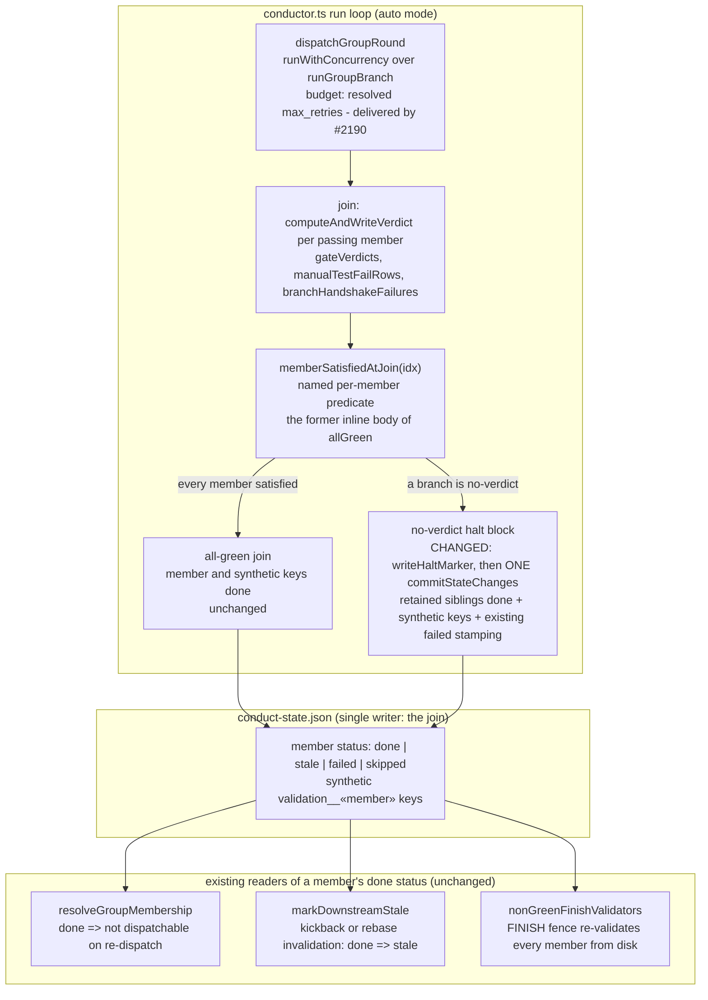

# Components: Validation-group no-verdict halt retains satisfied siblings (#1425)

**Last updated:** 2026-09-06
**Scope:** The auto-mode SHIP validation-group join in `conductor.ts` — which existing
components the retention change touches and which it deliberately leaves alone. The
per-flow view is in `sequences/one-transient-failure-in-a-validation-group-member.md`.
Only the node marked CHANGED is edited by this feature; the retry budget is delivered by
#2190 (PR #2206) and this spec is blocked by it.

## Diagram

## Legend

- **CHANGED** — the only edited component. The halt itself, its `needs-human` class, and
  its `failed`/`last_step` stamping are byte-for-byte as today; the commit that carries
  them additionally carries `done` for every member `memberSatisfiedAtJoin` accepted.
- **memberSatisfiedAtJoin** — a refactor, not new logic: the per-index body `allGreen`
  already evaluates (pass outcome; when `verifyArtifacts`: satisfied gate verdict, no
  handshake failure, no `manual_test` FAIL rows). Both `allGreen` and the halt block call it,
  so retention can never be wider than the all-green join's own notion of satisfied.
- **Readers (unchanged)** — the three consumers that give a retained `done` its meaning and
  its limits: skipped on re-dispatch, invalidated by any kickback or rebase, and re-checked
  at FINISH.
- `«…»` — placeholder for a variable value.

## Change Log

| Date | Change | Reason |
|------|--------|--------|
| 2026-09-06 | Initial generation | DECIDE phase for #1425 spec (land requires a top-level architecture artifact at the feature stem) |
