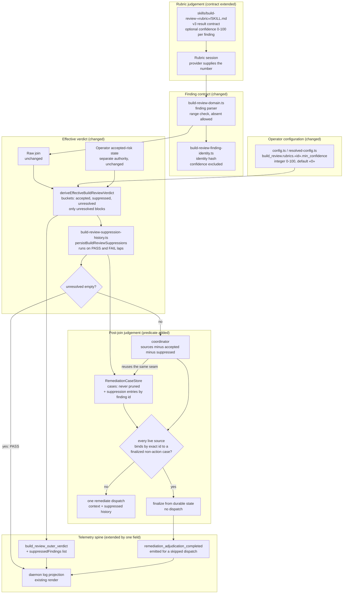

# Components: grader confidence floor and settled-recurrence fast-path for build_review

**Last updated:** 2026-09-06
**Scope:** Proposed component boundaries for jstoup111/ai-conductor#2383 as revised: per-finding
grader confidence, an operator floor applied at the effective-verdict reducer before build_review
fails, and a mechanical predicate that skips the remediate dispatch for exact-id recurrence of a
settled finding. Extends the settled rubric and adjudicator architecture in place; adds no seam.

## Diagram

## Legend

- **Changed components:** the finding parser gains an optional range-checked `confidence`; the
  identity hasher is explicitly untouched so the field never enters an id. The effective reducer gains
  a `suppressed` bucket. The coordinator gains the settled-recurrence predicate. Config gains one
  per-rubric key. One event member gains one additive field.
- **Two independent cost stops.** Suppression stops a sub-floor finding *before* build_review fails,
  so remediate is never dispatched for it. The settled-recurrence predicate stops a finding that
  *did* reach remediate and was deferred, rejected, or merged from re-dispatching on the next lap.
  Either alone leaves a spin; together nothing repeats without a reason.
- **Operator authority stays separate.** `suppressed` and `accepted` are different buckets with
  different authorities; the engine never writes a suppression into the operator disposition store.
- **Absent confidence blocks.** A finding without the field lands in `unresolved`. The fail-safe
  direction is cost, never silence.
- **Nothing is forgotten, on either route.** Suppressions are written to the durable case store by
  one seam, `persistBuildReviewSuppressions`, invoked from the effective-verdict path BEFORE the
  pass/fail fork — so a fully suppressed lap, which is an effective PASS that never enters post-join
  judgement (D4.4), still leaves its entries. The coordinator is not a second writer: it re-runs that
  same idempotent upsert, keyed by finding id, so a recurrence refreshes a row in place and nothing is
  ever duplicated. Entries enter the judge's context as non-blocking history; the store is never
  pruned, so resolved cases and old suppressions remain available when rubrics later conflict.
- **Exact-id only.** The predicate admits no fuzzy equivalence. A drifted id is a live source and
  dispatches the judge, which is the judgement the adjudicator was built to make.

## Change Log

| Date | Change | Reason |
|------|--------|--------|
| 2026-09-06 | Initial generation | Authored during DECIDE for jstoup111/ai-conductor#2383 |
| 2026-09-06 | Corrected demotion seam to judgement admission; added case store and adjudication context as changed components | Source trace during architecture-review |
| 2026-09-06 | Rewritten: confidence moved from the adjudicator case record to the rubric finding; floor moved to the effective reducer; settled-recurrence predicate added | Operator revised the placement after review showed the adjudicator floor could not stop the per-lap remediate re-dispatch |
| 2026-09-07 | Suppression persistence moved to a seam on the effective-verdict path, run on both PASS and FAIL laps; the coordinator reuses it instead of owning the only write | As-built review AB-1: a fully suppressed lap is an effective PASS and never reaches the coordinator, so D4.6 was unreachable for exactly the laps it governs |
