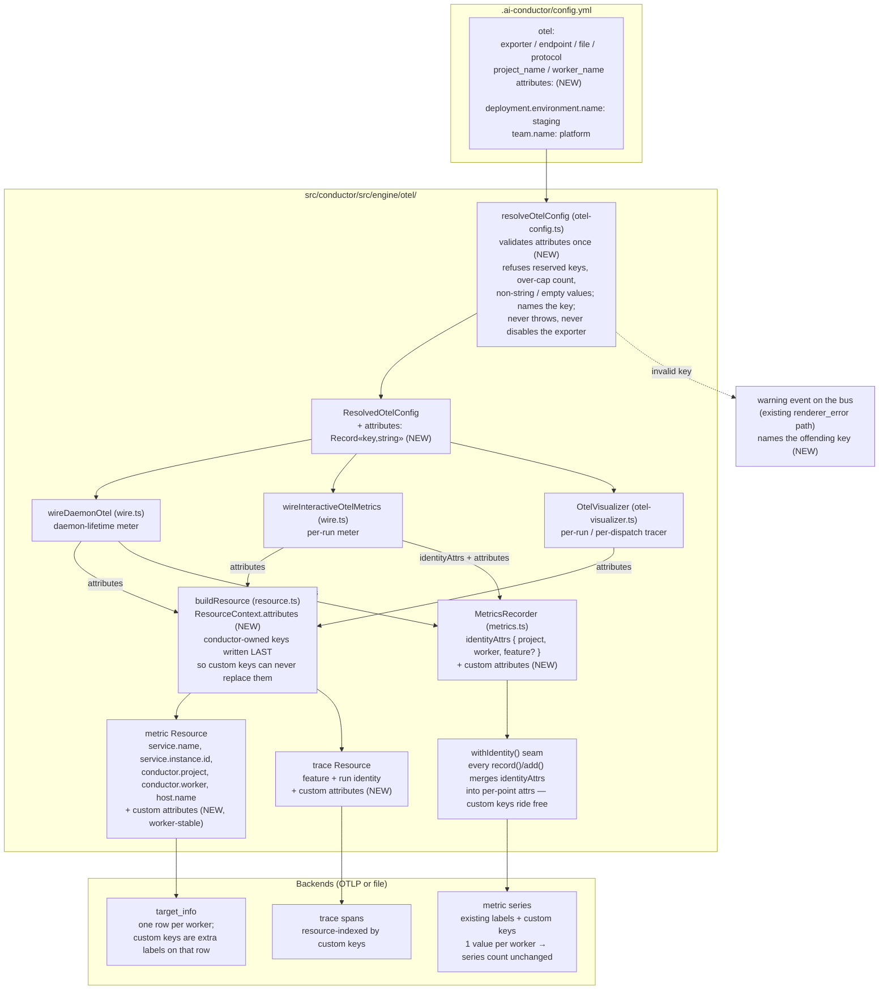

# Components: OTel operator-supplied static attributes (#2056)

**Last updated:** 2026-09-09
**Scope:** How an operator-supplied `otel.attributes` map in `.ai-conductor/config.yml` is
validated once and reaches every exported signal through `src/conductor/src/engine/otel/` — the
trace Resource, the worker-stable metric Resource, and every metric data point — in interactive and
daemon-dispatched runs, for both OTLP and file transport.

## Diagram

## Placement contract (consumer-facing)

| Carrier | Custom keys present? | Why |
|---------|----------------------|-----|
| trace Resource | yes | unified-service-tagging correlation; traces are per-run, no series cost |
| metric Resource | yes | one value per worker, so `target_info` stays one row per worker |
| metric data points | yes | the only placement every backend turns into a queryable tag without collector config |
| span attributes / data-point attributes from events | no | static config never varies per event; injecting per event would be a second seam |

- Values are config literals only. No environment-variable or template expansion, no per-feature
  override: this is what guarantees one value per worker and therefore zero new billed series on
  cardinality-priced backends.
- Reserved key prefixes (`service.`, `conductor.`, `host.`) and the data-point identity names
  (`project`, `worker`, `feature`) are refused at resolution. `buildResource` and `withIdentity`
  additionally write conductor-owned keys after the custom map, so even a key that escapes
  validation cannot replace them.
- The key count is capped (documented bound, refused with the first offending key beyond it), so
  an operator cannot widen every series' label set without bound.
- An invalid entry is dropped and reported by key on the existing warning path; the exporter stays
  enabled with the valid remainder. No custom key ever fails or delays a run.

## Legend

- **(NEW)** — added by this feature; all other nodes exist today.
- Three construction sites (`wireDaemonOtel`, `wireInteractiveOtelMetrics`, `OtelVisualizer`) all
  read the same resolved map; there is one resolution path and no second config surface.
- Guillemets mark placeholders.

## Change Log

| Date | Change | Reason |
|------|--------|--------|
| 2026-09-09 | Initial generation | DECIDE for #2056 (operator-supplied static telemetry attributes) |
| 2026-09-09 | Plan-update review: no structural change; the config allowlist/consumer-registry entry (plan Task 3) is bookkeeping on the existing `.ai-conductor/config.yml` node | /plan step 8b |
