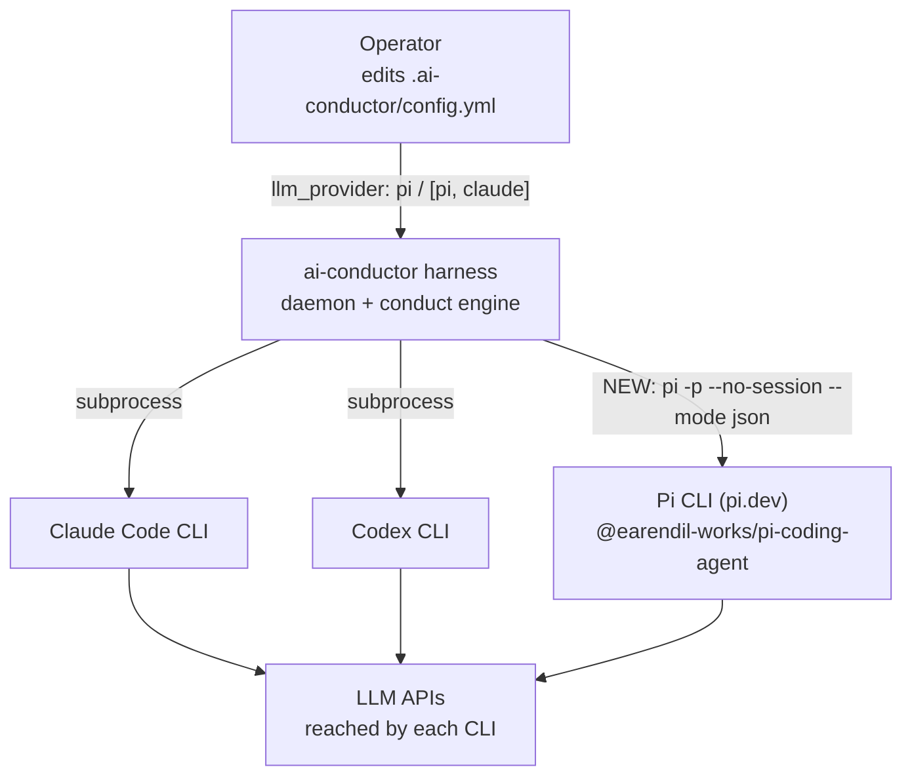
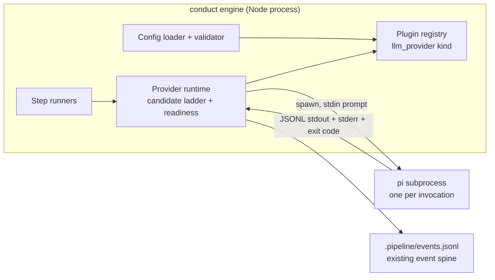
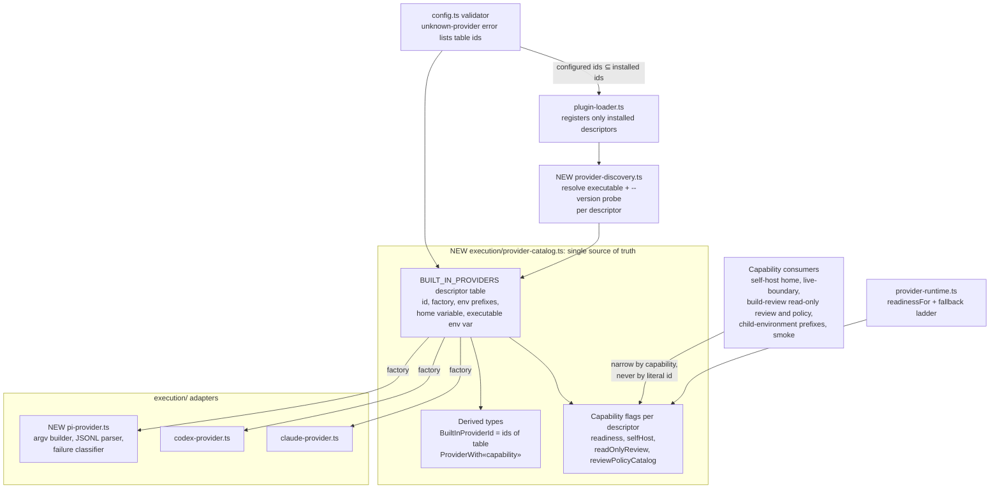
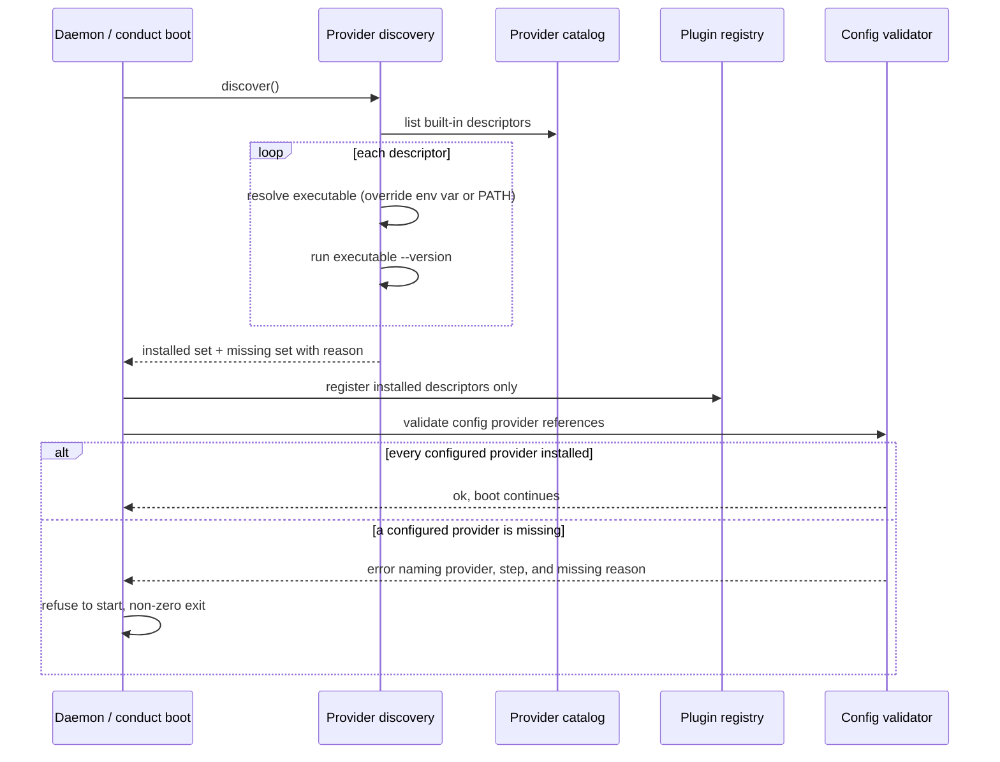
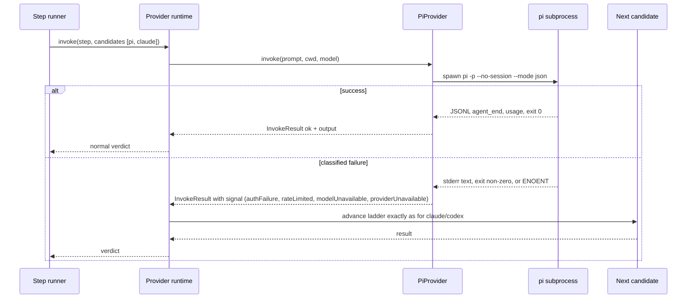

# Architecture: Pi as a build provider (#1884)

**Last updated:** 2026-09-24
**Scope:** A single built-in provider catalog that replaces every hardcoded `claude`/`codex` list,
boot-time discovery that registers only installed providers and fails fast on a configured-but-missing
one, plus a third built-in adapter for the Pi CLI (`pi -p --no-session --mode json`).

## Current state (grounding)

Two built-in providers are registered by hand (`engine/plugin-loader.ts:226-228`). About 25
production sites hardcode the pair as literal unions or branches. Among them:

- `engine/config.ts` — `BUILT_IN_MODEL_PROVIDERS`
- `engine/self-host/provider-home.ts:12` — `SelfHostProviderId`
- `execution/child-environment.ts:54` — `REVIEW_PROVIDER_PREFIXES`
- `execution/llm-provider.ts:169,294`
- `engine/step-runners.ts` (lines 651, 693-703, 2723, 2842, 3508)
- `engine/provider-execution.ts` (read-only review admission), `engine/build-review-policy-*.ts`
- `engine/self-host/live-boundary.ts:205,283`
- `engine/smoke-capability.ts:43`
- `engine/conductor.ts:6310`

## System Context (L1)

## Containers (L2)

## Components (L3)

## Sequence: Boot-time provider discovery

## Sequence: Pi step dispatch with fallback

## Legend

- **NEW** marks a component this feature adds. Everything else already exists and is edited.
- **Capability flags** describe what a descriptor supports. Pi declares none of the capabilities
  owned by sibling intakes: selfHost (#1887), containment (#1886), and the review policy catalog
  and skills (#1888). Consumers therefore refuse or skip Pi through the capability check, with a
  named error, rather than through a hardcoded list. Those intakes turn the flags on later.
- `«capability»` is a type-parameter placeholder.

## Change Log

| Date | Change | Reason |
|------|--------|--------|
| 2026-09-24 | Added boot-time discovery | Operator expanded scope: register installed providers, fail on configured-but-missing |
| 2026-09-24 | Initial generation | DECIDE for #1884 (Tier L, operator requested full diagrams) |
