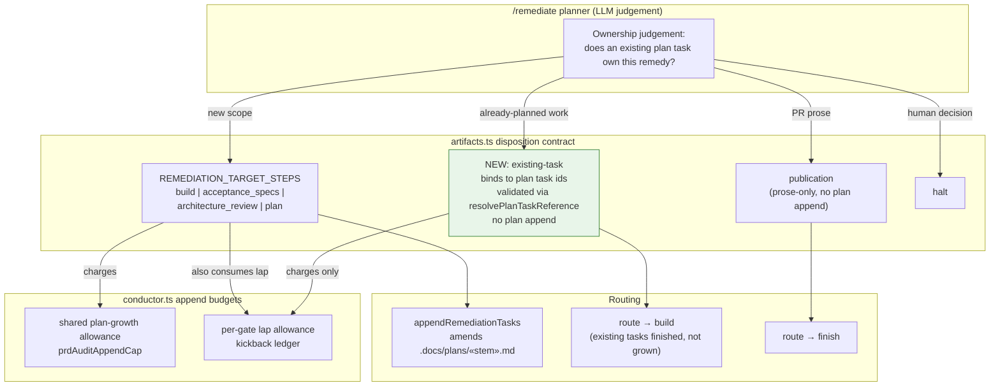

# Components: existing-task remediation disposition (#2119)

**Last updated:** 2026-08-31
**Scope:** The remediation disposition contract and the two append budgets it charges — adding an
`existing-task` disposition that binds a finding to existing plan task ids, bypasses plan-append,
and consumes the gate's lap allowance instead of plan-growth allowance.

## Diagram

## Legend

- Green node — new disposition introduced by this feature.
- «…» — variable segment placeholder.
- `existing-task` follows the `publication` precedent: deliberately outside
  `REMEDIATION_TARGET_STEPS`, so `remediationDispositionAppendsToPlan` returns false and the
  sealed plan is never amended for already-planned work.

## Change Log

| Date | Change | Reason |
|------|--------|--------|
| 2026-08-31 | Initial generation | DECIDE for #2119 |
